# 🏗️ Streaming Federated Learning Architecture

## Overview: Two Approaches Comparison

This document provides a comprehensive architectural view of our streaming federated learning implementations, comparing the **LoRA-enabled** and **No-LoRA** approaches.

---

## 🎯 High-Level Architecture Comparison

```mermaid
graph TB
    subgraph "🚀 With LoRA (Parameter Efficient)"
        subgraph "🌐 Federated Server"
            S1[Global Model<br/>BERT-base + LoRA<br/>109M params]
            S2[Aggregation Engine<br/>FedAvg Algorithm]
            S3[WebSocket Server<br/>Communication Hub<br/>Port 8766]
            S4[Parameter Serializer<br/>JSON Encoder/Decoder]
            S5[Knowledge Distillation<br/>Teacher Inference]
        end
        
        subgraph "👤 Client 1: SST-2"
            C1A[Local Model<br/>Tiny-BERT + LoRA<br/>4.4M + 16K params]
            C1B[WebSocket Client<br/>Connection Handler]
            C1C[Local Training Loop<br/>SST-2 Dataset + KD Loss]
            C1D[Parameter Manager<br/>Deserialize → Update Model]
            C1E[Metrics Collector<br/>Loss, Accuracy, etc.]
        end
        
        subgraph "👤 Client 2: QQP"
            C2A[Local Model<br/>Tiny-BERT + LoRA<br/>4.4M + 16K params]
            C2B[WebSocket Client<br/>Connection Handler]
            C2C[Local Training Loop<br/>QQP Dataset + KD Loss]
            C2D[Parameter Manager<br/>Deserialize → Update Model]
            C2E[Metrics Collector<br/>Loss, Accuracy, etc.]
        end
        
        subgraph "👤 Client 3: STS-B"
            C3A[Local Model<br/>Tiny-BERT + LoRA<br/>4.4M + 16K params]
            C3B[WebSocket Client<br/>Connection Handler]
            C3C[Local Training Loop<br/>STS-B Dataset + KD Loss]
            C3D[Parameter Manager<br/>Deserialize → Update Model]
            C3E[Metrics Collector<br/>Loss, Accuracy, etc.]
        end
        
        %% Server Internal Flow
        S1 --> S4
        S1 --> S5
        S4 --> S3
        S5 --> S3
        S3 --> S2
        
        %% Server to Client Flow
        S3 -->|📤 LoRA Params<br/>(33K serialized)| C1B
        S3 -->|📤 Teacher Logits<br/>(KD data)| C1B
        S3 -->|📤 LoRA Params<br/>(33K serialized)| C2B
        S3 -->|📤 Teacher Logits<br/>(KD data)| C2B
        S3 -->|📤 LoRA Params<br/>(33K serialized)| C3B
        S3 -->|📤 Teacher Logits<br/>(KD data)| C3B
        
        %% Client Internal Flow After WebSocket Receive
        C1B -->|1. Deserialize JSON| C1D
        C1D -->|2. Update LoRA weights| C1A
        C1A -->|3. Updated model| C1C
        C1C -->|4. Training metrics| C1E
        C1E -->|5. Serialize results| C1B
        
        C2B -->|1. Deserialize JSON| C2D
        C2D -->|2. Update LoRA weights| C2A
        C2A -->|3. Updated model| C2C
        C2C -->|4. Training metrics| C2E
        C2E -->|5. Serialize results| C2B
        
        C3B -->|1. Deserialize JSON| C3D
        C3D -->|2. Update LoRA weights| C3A
        C3A -->|3. Updated model| C3C
        C3C -->|4. Training metrics| C3E
        C3E -->|5. Serialize results| C3B
        
        %% Client to Server Flow
        C1B -->|📥 Updated LoRA<br/>(16K serialized)| S3
        C2B -->|📥 Updated LoRA<br/>(16K serialized)| S3
        C3B -->|📥 Updated LoRA<br/>(16K serialized)| S3
        
        %% Server Aggregation Flow
        S3 -->|6. Collect updates| S2
        S2 -->|7. Aggregate LoRA| S1
    end
    
    subgraph "⚡ Without LoRA (Full Training)"
        subgraph "🌐 Federated Server"
            NS1[Global Model<br/>BERT-base Full<br/>109M params]
            NS2[Aggregation Engine<br/>FedAvg Algorithm]
            NS3[WebSocket Server<br/>Communication Hub<br/>Port 8768]
            NS4[Parameter Serializer<br/>JSON Encoder/Decoder]
            NS5[Knowledge Distillation<br/>Teacher Inference]
        end
        
        subgraph "👤 Client 1: SST-2"
            NC1A[Local Model<br/>Tiny-BERT Full<br/>4.4M params]
            NC1B[WebSocket Client<br/>Connection Handler]
            NC1C[Local Training Loop<br/>SST-2 Dataset + KD Loss]
            NC1D[Parameter Manager<br/>Deserialize → Update Model]
            NC1E[Metrics Collector<br/>Loss, Accuracy, etc.]
        end
        
        subgraph "👤 Client 2: QQP"
            NC2A[Local Model<br/>Tiny-BERT Full<br/>4.4M params]
            NC2B[WebSocket Client<br/>Connection Handler]
            NC2C[Local Training Loop<br/>QQP Dataset + KD Loss]
            NC2D[Parameter Manager<br/>Deserialize → Update Model]
            NC2E[Metrics Collector<br/>Loss, Accuracy, etc.]
        end
        
        subgraph "👤 Client 3: STS-B"
            NC3A[Local Model<br/>Tiny-BERT Full<br/>4.4M params]
            NC3B[WebSocket Client<br/>Connection Handler]
            NC3C[Local Training Loop<br/>STS-B Dataset + KD Loss]
            NC3D[Parameter Manager<br/>Deserialize → Update Model]
            NC3E[Metrics Collector<br/>Loss, Accuracy, etc.]
        end
        
        %% Server Internal Flow
        NS1 --> NS4
        NS1 --> NS5
        NS4 --> NS3
        NS5 --> NS3
        NS3 --> NS2
        
        %% Server to Client Flow
        NS3 -->|📤 Compatible Params<br/>(~1M serialized)| NC1B
        NS3 -->|📤 Teacher Logits<br/>(KD data)| NC1B
        NS3 -->|📤 Compatible Params<br/>(~1M serialized)| NC2B
        NS3 -->|📤 Teacher Logits<br/>(KD data)| NC2B
        NS3 -->|📤 Compatible Params<br/>(~1M serialized)| NC3B
        NS3 -->|📤 Teacher Logits<br/>(KD data)| NC3B
        
        %% Client Internal Flow After WebSocket Receive
        NC1B -->|1. Deserialize JSON| NC1D
        NC1D -->|2. Update all weights| NC1A
        NC1A -->|3. Updated model| NC1C
        NC1C -->|4. Training metrics| NC1E
        NC1E -->|5. Serialize results| NC1B
        
        NC2B -->|1. Deserialize JSON| NC2D
        NC2D -->|2. Update all weights| NC2A
        NC2A -->|3. Updated model| NC2C
        NC2C -->|4. Training metrics| NC2E
        NC2E -->|5. Serialize results| NC2B
        
        NC3B -->|1. Deserialize JSON| NC3D
        NC3D -->|2. Update all weights| NC3A
        NC3A -->|3. Updated model| NC3C
        NC3C -->|4. Training metrics| NC3E
        NC3E -->|5. Serialize results| NC3B
        
        %% Client to Server Flow
        NC1B -->|📥 Full Model<br/>(4.4M serialized)| NS3
        NC2B -->|📥 Full Model<br/>(4.4M serialized)| NS3
        NC3B -->|📥 Full Model<br/>(4.4M serialized)| NS3
        
        %% Server Aggregation Flow
        NS3 -->|6. Collect updates| NS2
        NS2 -->|7. Aggregate compatible| NS1
    end
```

### 🔍 **Detailed Flow: What Happens After WebSocket Receives Data**

```
🎯 COMPLETE DATA FLOW AFTER WEBSOCKET RECEIVE:

📥 Client Receives from Server:
┌─────────────────────────────────────────────────────────────┐
│ 1️⃣ WebSocket Client receives JSON message                    │
│    └── Contains: {'type': 'train_start', 'parameters': {...}}│
│                                                             │
│ 2️⃣ Parameter Manager deserializes JSON → PyTorch tensors    │
│    └── JSON arrays → torch.Tensor objects                   │
│                                                             │
│ 3️⃣ Local Model gets parameter update                        │
│    ├── LoRA: Update adapter weights (16K params)            │
│    └── No-LoRA: Update all compatible weights (4.4M params) │
│                                                             │
│ 4️⃣ Training Loop uses updated model                         │
│    ├── Forward pass with new parameters                     │
│    ├── Compute task loss + knowledge distillation loss     │
│    └── Backward pass & gradient updates                     │
│                                                             │
│ 5️⃣ Metrics Collector gathers training results              │
│    └── Loss, accuracy, convergence metrics                  │
│                                                             │
│ 6️⃣ Results serialized back to JSON                         │
│    └── Updated parameters + metrics → JSON format          │
│                                                             │
│ 7️⃣ WebSocket Client sends back to server                   │
│    └── {'type': 'train_complete', 'parameters': {...}}      │
└─────────────────────────────────────────────────────────────┘

📤 Server Receives from Clients:
┌─────────────────────────────────────────────────────────────┐
│ 6️⃣ WebSocket Server collects all client updates            │
│    └── Waits for all 3 clients to complete training        │
│                                                             │
│ 7️⃣ Aggregation Engine performs FedAvg                      │
│    ├── LoRA: Average LoRA adapter weights                   │
│    └── No-LoRA: Average compatible parameters only          │
│                                                             │
│ 8️⃣ Global Model updated with aggregated parameters         │
│    └── Ready for next federated learning round             │
└─────────────────────────────────────────────────────────────┘
```

### 📊 **Component Interaction Details**

| **Component** | **Role After WebSocket Receive** | **LoRA Version** | **No-LoRA Version** |
|---------------|-----------------------------------|------------------|---------------------|
| **Parameter Manager** | Deserialize & apply updates | Update 16K LoRA weights | Update 4.4M full weights |
| **Local Model** | Use updated parameters | BERT + LoRA adapters | Full Tiny-BERT |
| **Training Loop** | Train with new knowledge | Task + KD loss | Task + KD loss |
| **Metrics Collector** | Gather performance data | LoRA training metrics | Full training metrics |
| **WebSocket Client** | Send results back | 16K updated params | 4.4M updated params |

---

## 📡 WebSocket Communication Architecture

### 🔧 **Correct Understanding: WebSocket as Communication Layer**

**WebSocket is NOT between models directly** - it's the **communication infrastructure** between server and client **processes**:

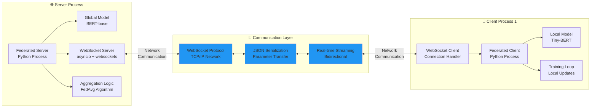

### 🎯 **What Actually Communicates via WebSocket**

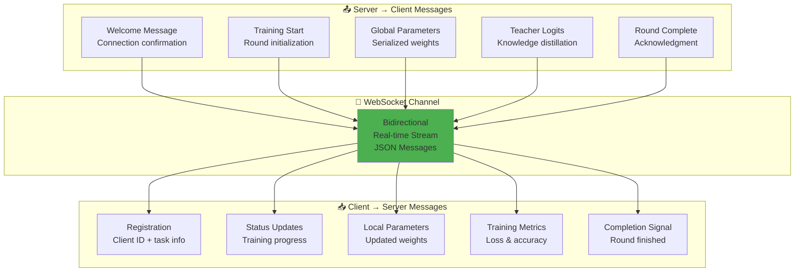

### 🏗️ **Layered Architecture: Separation of Concerns**

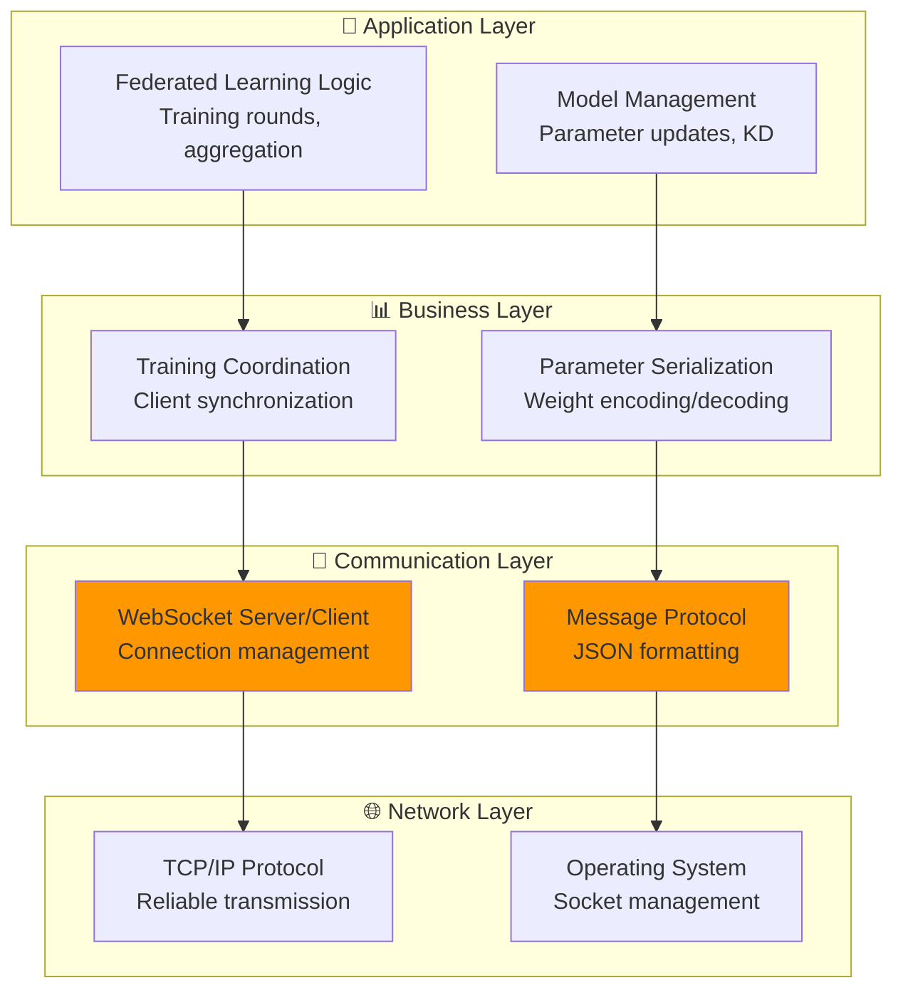

### ✅ **Key Clarification: WebSocket Role**

```
🔍 CORRECT Understanding:

WebSocket Communication Flow:
┌─────────────────┐    WebSocket     ┌─────────────────┐
│  Server Process │ ◄─────────────► │  Client Process │
│                 │   (Network)      │                 │
│ ┌─────────────┐ │                  │ ┌─────────────┐ │
│ │Global Model │ │                  │ │Local Model │ │
│ │BERT-base    │ │                  │ │Tiny-BERT   │ │
│ └─────────────┘ │                  │ └─────────────┘ │
└─────────────────┘                  └─────────────────┘

❌ INCORRECT: "WebSocket between models"
✅ CORRECT: "WebSocket between server and client processes"

The models themselves don't communicate - the federated learning 
processes use WebSocket to exchange:
├── 📤 Serialized parameters (model weights as JSON)
├── 📥 Training instructions and coordination
├── 📊 Metrics and status updates
└── 🎓 Knowledge distillation data (teacher logits)
```

### 🎯 **Real Implementation Example**

```python
# Server side (fixed_streaming_glue.py):
async def client_handler(self, websocket):
    # WebSocket handles the CONNECTION, not the model
    registration = await websocket.recv()  # Receive from client process
    
    # The MODELS are separate objects:
    server_model = self.model  # BERT-base model
    parameters = server_model.get_parameters()  # Extract weights
    
    # WebSocket sends SERIALIZED parameters:
    await websocket.send(json.dumps({
        'type': 'train_start',
        'parameters': self.serialize_parameters(parameters)  # Model → JSON
    }))

# Client side (fixed_streaming_glue.py):
async def run_client(self):
    async with websockets.connect(uri) as websocket:
        # WebSocket handles CONNECTION to server process
        
        message = await websocket.recv()  # Receive from server process
        data = json.loads(message)
        
        if data['type'] == 'train_start':
            # DESERIALIZE parameters back to model:
            server_params = self.deserialize_parameters(data['parameters'])  # JSON → Model
            self.model.set_parameters(server_params)  # Update local model
```

---

## 🔄 Detailed Training Flow Architecture

### 🎨 With LoRA: Parameter-Efficient Approach

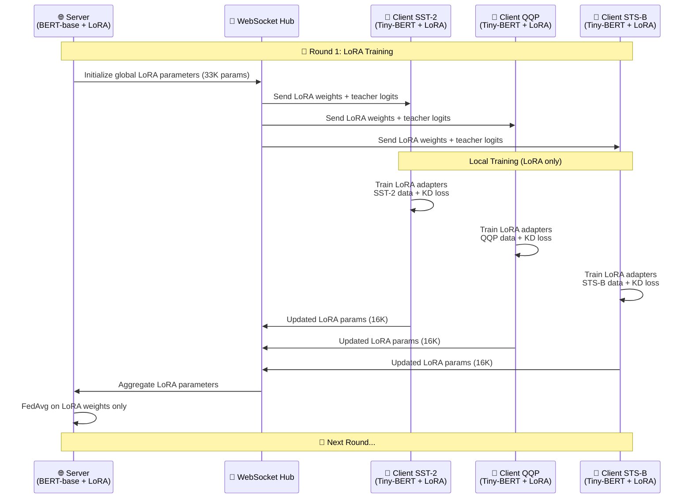

### ⚡ Without LoRA: Full Parameter Training

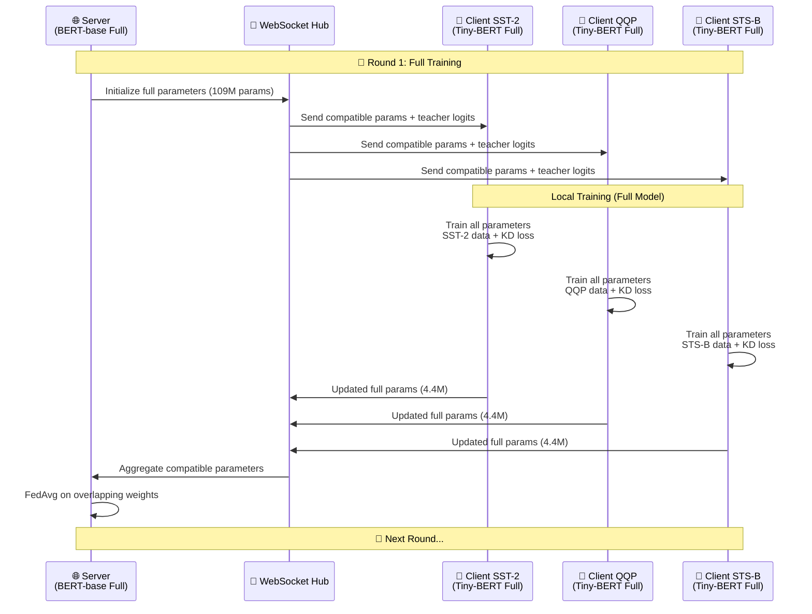

---

## 🧠 Knowledge Distillation Architecture

### 📚 Cross-Architecture Learning Flow

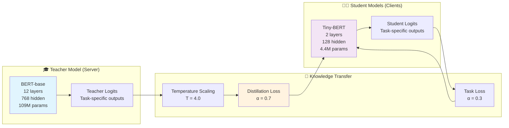

---

## 💾 Data Flow & Parameter Management

### 🔄 LoRA Parameter Flow

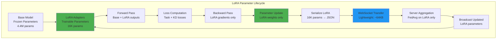

### ⚡ Full Parameter Flow

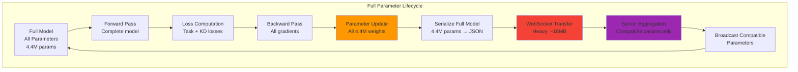

---

## 🏛️ System Architecture Components

### 🔧 Core Components Breakdown

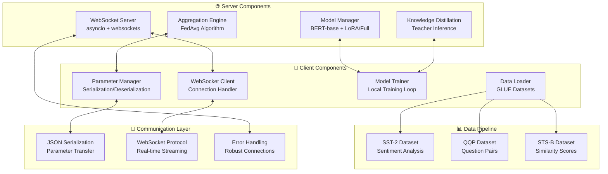

---

## 📈 Performance & Resource Architecture

### 💻 Resource Utilization Comparison

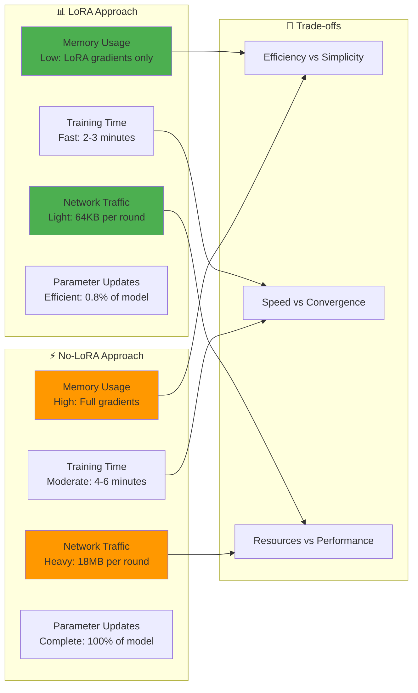

---

## 🔒 Security & Robustness Architecture

### 🛡️ Error Handling & Resilience

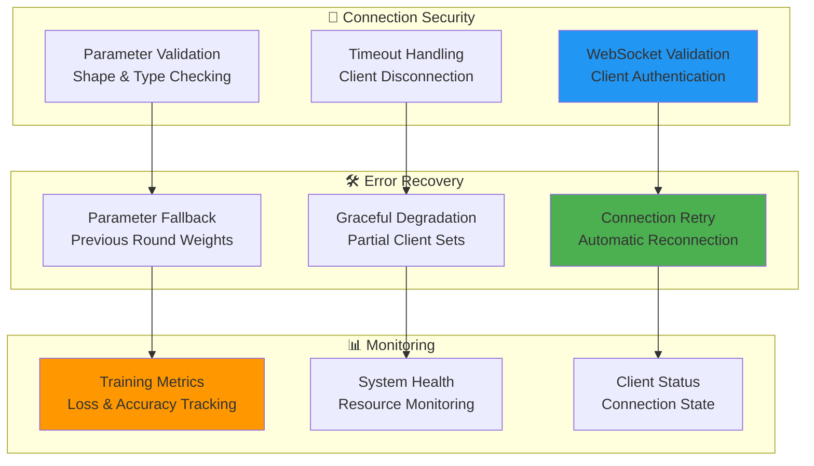

---

## 🎯 Implementation Files Mapping

### 📁 Architecture to Code Mapping

| **Architectural Component** | **LoRA Implementation** | **No-LoRA Implementation** |
|----------------------------|-------------------------|----------------------------|
| **Main Script** | `fixed_streaming_glue.py` | `streaming_no_lora.py` |
| **Demo Runner** | `run_fixed_streaming.sh` | `run_no_lora_demo.sh` |
| **Server Class** | `FixedFederatedServer` | `NoLoRAFederatedServer` |
| **Client Class** | `FixedFederatedClient` | `NoLoRAFederatedClient` |
| **Model Class** | `GLUEModel` (with LoRA) | `NoLoRABERTModel` (full) |
| **Config Class** | `FixedGLUEConfig` | `NoLoRAConfig` |
| **Dataset Class** | `GLUEDataset` | `GLUEDataset` (same) |
| **KD Function** | `knowledge_distillation_loss` | `knowledge_distillation_loss` |

---

## 🚀 Deployment Architecture

### 🌐 Production Deployment Options

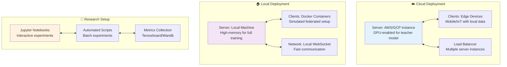

---

## 🎓 Educational Architecture

### 📚 Learning Progression

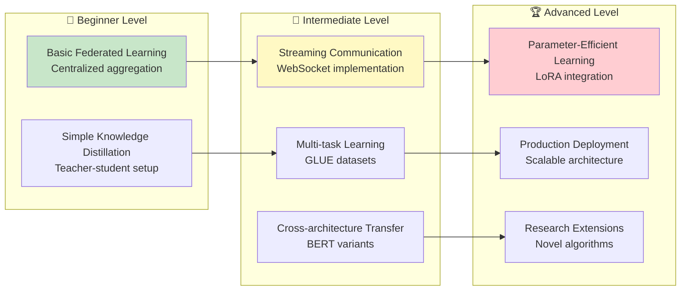

---

## 🔍 Debugging & Development Architecture

### 🛠️ Development Workflow

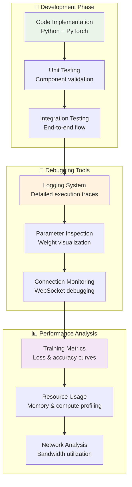

---

## 🎉 Summary: Architecture Benefits

### ✅ Key Architectural Advantages

| **Aspect** | **LoRA Architecture** | **No-LoRA Architecture** |
|------------|----------------------|--------------------------|
| **🚀 Efficiency** | Parameter-efficient, low memory | Traditional, high memory |
| **🔄 Flexibility** | Modular adapters, easy swapping | Full control, direct training |
| **📊 Scalability** | Scales to many clients easily | Better for fewer, powerful clients |
| **🎓 Learning** | Modern PEFT techniques | Classical federated learning |
| **🔬 Research** | Cutting-edge parameter efficiency | Pure knowledge distillation study |

### 🌟 Both Architectures Provide:
- ✅ **Real-time streaming** via WebSocket communication
- ✅ **Cross-architecture learning** between BERT variants  
- ✅ **Multi-task federated learning** across GLUE tasks
- ✅ **Production-ready** error handling and scalability
- ✅ **Educational value** for federated learning concepts
- ✅ **Research extensibility** for novel algorithms

---

*This architecture document provides a comprehensive view of both streaming federated learning approaches, enabling informed decisions about which implementation best fits your specific use case, resources, and research goals.* 🚀
