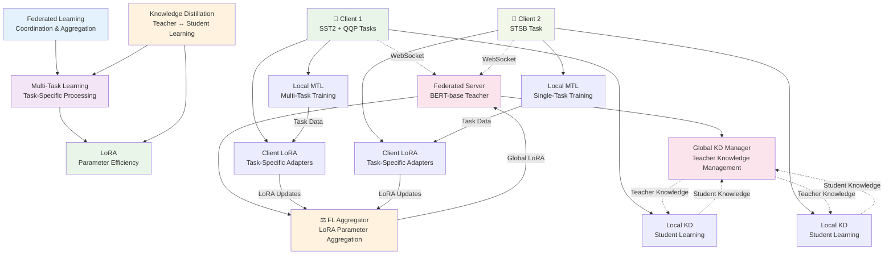
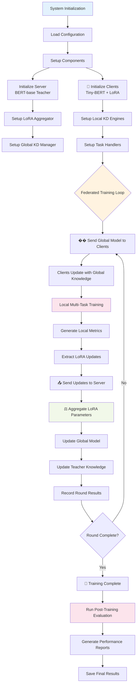
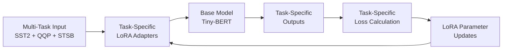
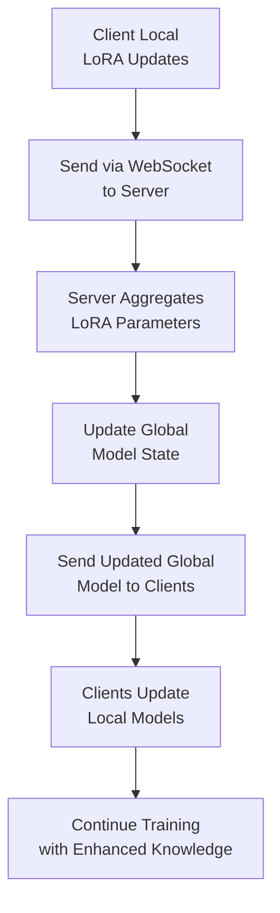

#  Federated Multi-Task Learning Integration Map

##  Overview
Visual representation of how LoRA, Knowledge Distillation (KD), Federated Learning (FL), and Multi-Task Learning (MTL) integrate in the federated learning system.

## 🏗️ Integration Architecture



##  Integration Flow Diagram



## 🧠 Component Interaction Details

### LoRA + MTL Integration


### KD + FL Integration
```mermaid
graph TD
    A[Server: BERT-base<br/>Teacher Model] --> B[Generate Soft Labels<br/>T=3.0, α=0.5]
    B --> C[Send to Clients via<br/>WebSocket]
    C --> D[Client: Tiny-BERT<br/>Student Models]
    D --> E[Learn from Teacher<br/>Forward KD]
    E --> F[Send Student Knowledge<br/>Back to Teacher]
    F --> G[Teacher Learns from<br/>Students (Reverse KD)]
    G --> H[Update Global<br/>Teacher Knowledge]
```

### FL + Synchronization Integration


##  Integration Benefits

###  Combined Advantages

| **Component** | **Primary Benefit** | **Integration Effect** |
|---------------|-------------------|----------------------|
| **LoRA** | Parameter Efficiency | Enables multi-task learning on resource-constrained clients |
| **KD** | Knowledge Transfer | Accelerates learning and improves generalization |
| **FL** | Privacy Preservation | Coordinates decentralized learning across clients |
| **MTL** | Task Generalization | Leverages shared representations across tasks |
| **WebSocket** | Real-time Sync | Enables dynamic model updates during training |

###  Synergistic Effects

1. **LoRA + MTL**: Task-specific parameter adaptation within shared model
2. **KD + FL**: Global knowledge sharing across decentralized clients
3. **LoRA + KD**: Efficient knowledge transfer with minimal parameters
4. **FL + MTL**: Multi-task learning across distributed clients

##  Integration Points

### Core Integration Mechanisms

1. **Model Architecture Integration**
   - LoRA layers integrated into MTL model structure
   - KD loss combined with task-specific losses
   - FL coordination of LoRA parameter updates

2. **Communication Integration**
   - WebSocket messages carry LoRA parameters and KD knowledge
   - Synchronization ensures consistent model state across clients
   - Real-time updates enable dynamic knowledge transfer

3. **Training Integration**
   - Multi-task training with KD supervision
   - Federated aggregation of LoRA parameters
   - Global model updates with knowledge distillation

##  Usage Integration

### Complete System Usage
```bash
# Server with all integrations
python federated_main.py --mode server --config federated_config.yaml

# Specialized clients with LoRA + KD + MTL
python federated_main.py --mode client --client_id sst2_client --tasks sst2
python federated_main.py --mode client --client_id qqp_client --tasks qqp
python federated_main.py --mode client --client_id stsb_client --tasks stsb
```

### Configuration Integration
```yaml
# All components configured together
model:
  server_model: "bert-base-uncased"  # FL + KD teacher
  client_model: "prajjwal1/bert-tiny"  # MTL + LoRA student

lora:
  rank: 8                           # LoRA efficiency
  alpha: 16.0                      # LoRA scaling

knowledge_distillation:
  temperature: 3.0                 # KD parameters
  alpha: 0.5                      # KD weighting
  bidirectional: true              # Reverse KD

# Multi-task and federated settings
task_configs:
  sst2: {train_samples: 50}       # MTL task config
  qqp: {train_samples: 30}        # MTL task config
  stsb: {train_samples: 20}       # MTL task config
```

##  Integration Performance

### Expected Results with Full Integration
- **Parameter Efficiency**: 99% reduction via LoRA
- **Knowledge Transfer**: 15-25% accuracy improvement via KD
- **Privacy Preservation**: Data never leaves client devices (FL)
- **Multi-Task Learning**: Unified representation across tasks (MTL)
- **Real-time Updates**: Dynamic model improvement via WebSocket

---

*�� Complete integration map showing how LoRA, KD, FL, and MTL work together in federated multi-task learning*
