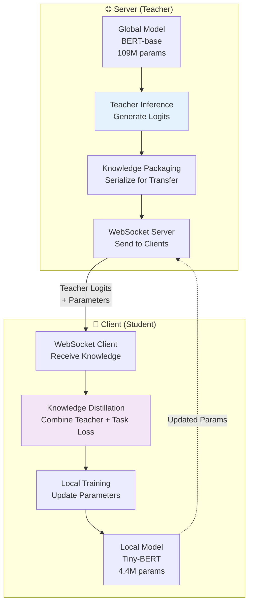

# 🎓 Knowledge Distillation Implementation Guide

## Complete Guide: How to Create Knowledge Distillation in Streaming Federated Learning

This guide shows **exactly** how knowledge distillation is implemented in our streaming federated learning system, from teacher model inference to student model training.

---

## 🏗️ Architecture Overview



---

## 🎯 Step 1: Teacher Model Setup (Server Side)

### 📊 Server Model Initialization

```python
class FixedFederatedServer:
    def __init__(self, config: FixedGLUEConfig):
        self.config = config
        self.device = torch.device("cuda" if torch.cuda.is_available() else "cpu")
        
        # 🎓 TEACHER MODEL: Global BERT-base model
        self.global_model = GLUEModel(
            model_name=config.server_model,  # "bert-base-uncased"
            num_labels=2,  # For classification tasks
            config=config
        )
        self.global_model.to(self.device)
        
        logger.info(f"🎓 Teacher model initialized: {config.server_model}")
        logger.info(f"📊 Model parameters: {sum(p.numel() for p in self.global_model.parameters()):,}")
```

### 🧠 Teacher Knowledge Generation

```python
def generate_teacher_knowledge(self):
    """Generate teacher knowledge for knowledge distillation"""
    self.global_model.eval()  # Set to evaluation mode
    
    # Create dummy batch for knowledge generation
    batch_size = 4
    seq_len = 128
    
    # Generate dummy inputs (in practice, use real data)
    dummy_input_ids = torch.randint(0, 1000, (batch_size, seq_len)).to(self.device)
    dummy_attention_mask = torch.ones(batch_size, seq_len).to(self.device)
    
    with torch.no_grad():  # No gradients needed for teacher inference
        # 🎓 TEACHER INFERENCE: Generate soft predictions
        outputs = self.global_model(
            input_ids=dummy_input_ids, 
            attention_mask=dummy_attention_mask
        )
        teacher_logits = outputs['logits'].cpu()  # Move to CPU for serialization
    
    # 📦 PACKAGE KNOWLEDGE for transfer
    return {
        'logits': teacher_logits.tolist(),  # Convert to JSON-serializable format
        'temperature': self.config.distillation_temperature,  # T = 4.0
        'alpha': self.config.distillation_alpha  # α = 0.7
    }
```

### 📡 Knowledge Transfer via WebSocket

```python
async def start_federated_round(self, round_num):
    """Start federated round with knowledge distillation"""
    self.current_round = round_num
    
    logger.info(f"🚀 Starting round {round_num}")
    
    # 🧠 GENERATE TEACHER KNOWLEDGE
    teacher_knowledge = self.generate_teacher_knowledge()
    
    # 📤 SEND TO ALL CLIENTS
    message = {
        'type': 'round_start',
        'round_number': round_num,
        'teacher_knowledge': teacher_knowledge,  # 🎓 Teacher logits + config
        'global_parameters': self.serialize_parameters(),  # Model weights
        'local_epochs': self.config.local_epochs
    }
    
    await self.broadcast_message(message)
```

---

## 🎯 Step 2: Knowledge Distillation Loss Function

### 🧮 Core KD Loss Implementation

```python
def knowledge_distillation_loss(student_logits, teacher_logits, labels, temperature, alpha, task_type):
    """
    Compute knowledge distillation loss
    
    Args:
        student_logits: Predictions from student model (Tiny-BERT)
        teacher_logits: Predictions from teacher model (BERT-base)
        labels: Ground truth labels
        temperature: Softmax temperature for distillation (T = 4.0)
        alpha: Weight for distillation vs task loss (α = 0.7)
        task_type: 'classification' or 'regression'
    
    Returns:
        total_loss, kd_loss, task_loss
    """
    
    # 🔧 HANDLE DIMENSION MISMATCHES
    if student_logits.dim() != teacher_logits.dim():
        if student_logits.dim() == 1:
            student_logits = student_logits.unsqueeze(0)
        if teacher_logits.dim() == 1:
            teacher_logits = teacher_logits.unsqueeze(0)
    
    # 📏 ENSURE SAME BATCH SIZE
    min_batch_size = min(student_logits.size(0), teacher_logits.size(0))
    student_logits = student_logits[:min_batch_size]
    teacher_logits = teacher_logits[:min_batch_size]
    labels = labels[:min_batch_size]
    
    if task_type == 'regression':
        # 📊 REGRESSION TASKS (STS-B)
        kd_loss = nn.MSELoss()(student_logits.squeeze(), teacher_logits.squeeze())
        task_loss = nn.MSELoss()(student_logits.squeeze(), labels)
    else:
        # 🏷️ CLASSIFICATION TASKS (SST-2, QQP)
        
        # Handle different output dimensions (BERT-base vs Tiny-BERT)
        if student_logits.size(-1) != teacher_logits.size(-1):
            min_dim = min(student_logits.size(-1), teacher_logits.size(-1))
            student_logits = student_logits[:, :min_dim]
            teacher_logits = teacher_logits[:, :min_dim]
        
        # 🌡️ TEMPERATURE SCALING: Soften predictions
        soft_teacher = torch.softmax(teacher_logits / temperature, dim=-1)
        soft_student = torch.log_softmax(student_logits / temperature, dim=-1)
        
        # 📚 KNOWLEDGE DISTILLATION LOSS: KL divergence between soft predictions
        kd_loss = nn.KLDivLoss(reduction='batchmean')(soft_student, soft_teacher) * (temperature ** 2)
        
        # 🎯 TASK LOSS: Standard cross-entropy with hard labels
        task_loss = nn.CrossEntropyLoss()(student_logits, labels.long())
    
    # 🔄 COMBINE LOSSES: Weighted sum
    total_loss = alpha * kd_loss + (1 - alpha) * task_loss
    
    return total_loss, kd_loss, task_loss
```

### 🎓 Advanced Multi-Level Knowledge Distillation

```python
class MultiLevelKnowledgeDistillation(nn.Module):
    """Advanced knowledge distillation with multiple levels"""
    
    def __init__(self, temperature: float = 4.0, alpha: float = 0.7, feature_weight: float = 0.3):
        super().__init__()
        self.temperature = temperature
        self.alpha = alpha
        self.feature_weight = feature_weight
        
        self.kl_div = nn.KLDivLoss(reduction='batchmean')
        self.ce_loss = nn.CrossEntropyLoss()
        self.mse_loss = nn.MSELoss()
    
    def forward(self, student_outputs, teacher_outputs, labels):
        student_logits = student_outputs['logits']
        teacher_logits = teacher_outputs['logits']
        
        # 1️⃣ LOGIT DISTILLATION: Soft targets from teacher
        student_soft = torch.log_softmax(student_logits / self.temperature, dim=1)
        teacher_soft = torch.softmax(teacher_logits / self.temperature, dim=1)
        logit_distillation_loss = self.kl_div(student_soft, teacher_soft) * (self.temperature ** 2)
        
        # 2️⃣ TASK LOSS: Hard targets from ground truth
        task_loss = self.ce_loss(student_logits, labels)
        
        # 3️⃣ FEATURE DISTILLATION: Hidden representations (optional)
        feature_distillation_loss = 0.0
        if 'pooler_output' in student_outputs and 'pooler_output' in teacher_outputs:
            student_features = student_outputs['pooler_output']
            teacher_features = teacher_outputs['pooler_output']
            
            # Project to same dimension if needed
            if student_features.size(-1) != teacher_features.size(-1):
                min_dim = min(student_features.size(-1), teacher_features.size(-1))
                student_features = student_features[:, :min_dim]
                teacher_features = teacher_features[:, :min_dim]
            
            feature_distillation_loss = self.mse_loss(student_features, teacher_features)
        
        # 🔄 COMBINED LOSS
        total_loss = (
            self.alpha * logit_distillation_loss + 
            (1 - self.alpha) * task_loss + 
            self.feature_weight * feature_distillation_loss
        )
        
        return total_loss, logit_distillation_loss, task_loss, feature_distillation_loss
```

---

## 🎯 Step 3: Student Model Training (Client Side)

### 👨‍🎓 Client Model Setup

```python
class FixedFederatedClient:
    def __init__(self, client_id: str, task: str, config: FixedGLUEConfig):
        self.client_id = client_id
        self.task = task.lower()
        self.config = config
        
        # 👨‍🎓 STUDENT MODEL: Tiny-BERT model
        self.model = GLUEModel(
            model_name=config.client_model,  # "prajjwal1/bert-tiny"
            num_labels=2 if task != 'stsb' else 1,
            config=config
        )
        
        # 🎓 KNOWLEDGE DISTILLATION LOSS
        self.kd_loss = KnowledgeDistillationLoss(
            temperature=config.distillation_temperature,  # T = 4.0
            alpha=config.distillation_alpha  # α = 0.7
        )
        
        self.device = torch.device('cuda' if torch.cuda.is_available() else 'cpu')
        self.model.to(self.device)
        
        logger.info(f"👨‍🎓 Student model initialized: {config.client_model}")
```

### 🏋️ Local Training with Knowledge Distillation

```python
def local_training_with_distillation(self, teacher_knowledge: Optional[Dict] = None):
    """Train student model with knowledge distillation"""
    self.model.train()
    dataloader = DataLoader(self.dataset, batch_size=self.config.batch_size, shuffle=True)
    
    total_loss = 0.0
    total_kd_loss = 0.0
    total_task_loss = 0.0
    
    for epoch in range(self.config.local_epochs):
        for batch_idx, batch in enumerate(dataloader):
            input_ids = batch['input_ids'].to(self.device)
            attention_mask = batch['attention_mask'].to(self.device)
            labels = batch['labels'].to(self.device)
            
            self.optimizer.zero_grad()
            
            # 👨‍🎓 STUDENT FORWARD PASS
            student_outputs = self.model(
                input_ids=input_ids,
                attention_mask=attention_mask,
                labels=labels
            )
            
            # 🎓 KNOWLEDGE DISTILLATION
            if teacher_knowledge is not None:
                # Extract teacher logits for this batch
                start_idx = batch_idx * self.config.batch_size
                end_idx = start_idx + input_ids.size(0)
                
                if start_idx < len(teacher_knowledge['logits']):
                    teacher_logits = torch.tensor(
                        teacher_knowledge['logits'][start_idx:end_idx]
                    ).to(self.device)
                    
                    # 🧮 COMPUTE DISTILLATION LOSS
                    loss, kd_loss, task_loss = self.kd_loss(
                        student_outputs['logits'],
                        teacher_logits,
                        labels
                    )
                    
                    total_kd_loss += kd_loss.item()
                    total_task_loss += task_loss.item()
                else:
                    # Fallback to regular training
                    loss = student_outputs['loss']
                    total_task_loss += loss.item()
            else:
                # Regular training without teacher
                loss = student_outputs['loss']
                total_task_loss += loss.item()
            
            # 🔄 BACKPROPAGATION
            loss.backward()
            self.optimizer.step()
            
            total_loss += loss.item()
    
    # 📊 RETURN TRAINING METRICS
    num_batches = len(dataloader) * self.config.local_epochs
    return {
        'total_loss': total_loss / num_batches,
        'kd_loss': total_kd_loss / num_batches,
        'task_loss': total_task_loss / num_batches
    }
```

### 📡 WebSocket Knowledge Reception

```python
async def run_client(self):
    """Main client execution with knowledge distillation"""
    uri = f"ws://{self.config.server_host}:{self.config.server_port}"
    
    async with websockets.connect(uri) as websocket:
        # Register with server
        await websocket.send(json.dumps({
            'client_id': self.client_id,
            'task': self.task
        }))
        
        while True:
            message = await websocket.recv()
            data = json.loads(message)
            
            if data['type'] == 'round_start':
                # 📥 RECEIVE TEACHER KNOWLEDGE
                teacher_knowledge = data.get('teacher_knowledge')
                global_parameters = data.get('global_parameters')
                
                logger.info(f"🎓 Received teacher knowledge for round {data['round_number']}")
                
                # Update model with global parameters
                if global_parameters:
                    self.update_model_parameters(global_parameters)
                
                # 🏋️ TRAIN WITH KNOWLEDGE DISTILLATION
                training_metrics = self.local_training_with_distillation(teacher_knowledge)
                
                # 📤 SEND RESULTS BACK
                result = {
                    'type': 'round_complete',
                    'client_id': self.client_id,
                    'round_number': data['round_number'],
                    'parameters': self.serialize_parameters(),
                    'metrics': training_metrics
                }
                await websocket.send(json.dumps(result))
```

---

## 🎯 Step 4: Configuration and Hyperparameters

### ⚙️ Knowledge Distillation Configuration

```python
@dataclass
class FixedGLUEConfig:
    # Model configurations
    server_model: str = "bert-base-uncased"      # 🎓 Teacher model
    client_model: str = "prajjwal1/bert-tiny"    # 👨‍🎓 Student model
    
    # Knowledge distillation parameters
    distillation_temperature: float = 4.0        # 🌡️ Temperature scaling
    distillation_alpha: float = 0.7              # ⚖️ KD vs task loss weight
    
    # Training parameters
    num_rounds: int = 3
    local_epochs: int = 2
    batch_size: int = 8
    learning_rate: float = 2e-5
    max_samples_per_client: int = 100
```

### 🎛️ Hyperparameter Explanation

| **Parameter** | **Value** | **Purpose** | **Effect** |
|---------------|-----------|-------------|------------|
| **Temperature (T)** | 4.0 | Soften probability distributions | Higher = softer, more knowledge transfer |
| **Alpha (α)** | 0.7 | Balance KD vs task loss | Higher = more focus on teacher knowledge |
| **Learning Rate** | 2e-5 | Student model optimization | Lower for stable distillation |
| **Batch Size** | 8 | Training efficiency | Smaller for memory constraints |

---

## 🎯 Step 5: Real Implementation Examples

### 📊 Classification Task (SST-2, QQP)

```python
# Teacher generates soft predictions
teacher_logits = [
    [2.1, -1.8],  # Batch 1: Strong positive sentiment
    [-0.5, 0.3],  # Batch 2: Slight negative sentiment
    [1.2, -0.9]   # Batch 3: Positive sentiment
]

# Student learns from both teacher and ground truth
student_logits = [
    [1.8, -1.2],  # Student prediction
    [-0.2, 0.1],  # Student prediction
    [0.9, -0.6]   # Student prediction
]

labels = [1, 0, 1]  # Ground truth

# Knowledge distillation combines both
kd_loss = KL_divergence(softmax(student/T), softmax(teacher/T)) * T²
task_loss = CrossEntropy(student, labels)
total_loss = 0.7 * kd_loss + 0.3 * task_loss
```

### 📈 Regression Task (STS-B)

```python
# Teacher generates continuous predictions
teacher_logits = [3.2, 1.8, 4.1]  # Similarity scores 0-5

# Student learns to match teacher predictions
student_logits = [2.9, 1.5, 3.8]  # Student predictions

labels = [3.0, 2.0, 4.0]  # Ground truth similarity

# Regression knowledge distillation
kd_loss = MSE(student, teacher)
task_loss = MSE(student, labels)
total_loss = 0.7 * kd_loss + 0.3 * task_loss
```

---

## 🎯 Step 6: Performance Monitoring

### 📊 Training Metrics

```python
def evaluate_distillation_effectiveness(self):
    """Evaluate knowledge distillation effectiveness"""
    metrics = {
        'student_accuracy': self.evaluate_student_model(),
        'teacher_accuracy': self.evaluate_teacher_model(),
        'knowledge_transfer_ratio': self.calculate_knowledge_transfer(),
        'distillation_loss_trend': self.track_kd_loss_over_time(),
        'task_loss_trend': self.track_task_loss_over_time()
    }
    
    logger.info(f"📊 KD Effectiveness: {metrics}")
    return metrics
```

### 🎯 Success Indicators

```
✅ Successful Knowledge Distillation:
├── 📈 Student accuracy improves over rounds
├── 📉 KD loss decreases (student matches teacher better)
├── ⚖️ Balanced KD and task losses
├── 🎓 Student learns teacher's "soft" knowledge
└── 🚀 Faster convergence than without KD

❌ Poor Knowledge Distillation:
├── 📉 Student accuracy stagnates
├── 📈 KD loss remains high
├── ⚖️ Imbalanced loss components
├── 🎓 Student ignores teacher knowledge
└── 🐌 Slower convergence
```

---

## 🎯 Step 7: Advanced Features

### 🔄 Dynamic Temperature Scheduling

```python
def adaptive_temperature_scheduling(self, round_num, max_rounds):
    """Dynamically adjust temperature during training"""
    # Start high (soft), gradually decrease (harder)
    initial_temp = 6.0
    final_temp = 2.0
    
    progress = round_num / max_rounds
    current_temp = initial_temp * (1 - progress) + final_temp * progress
    
    self.config.distillation_temperature = current_temp
    logger.info(f"🌡️ Temperature adjusted to {current_temp:.2f}")
```

### 🎯 Task-Specific Knowledge Distillation

```python
def task_specific_distillation(self, task_type):
    """Adjust KD parameters based on task"""
    if task_type == 'sst2':  # Sentiment analysis
        self.config.distillation_alpha = 0.8  # More teacher focus
        self.config.distillation_temperature = 4.0
    elif task_type == 'qqp':  # Question pairs
        self.config.distillation_alpha = 0.6  # Balanced
        self.config.distillation_temperature = 3.0
    elif task_type == 'stsb':  # Similarity regression
        self.config.distillation_alpha = 0.7  # Moderate teacher focus
        self.config.distillation_temperature = 2.0  # Lower for regression
```

---

## 🎉 Summary: Complete Knowledge Distillation Pipeline

```
🎓 KNOWLEDGE DISTILLATION FLOW:

1️⃣ Server (Teacher):
   ├── 🧠 BERT-base generates soft predictions (logits)
   ├── 📦 Package knowledge with temperature & alpha
   └── 📤 Send via WebSocket to all clients

2️⃣ Client (Student):
   ├── 📥 Receive teacher knowledge + global parameters
   ├── 🧮 Compute KD loss: α*KL_div + (1-α)*task_loss
   ├── 🏋️ Train with combined loss
   └── 📤 Send updated parameters back

3️⃣ Benefits:
   ├── 🚀 Faster convergence than standalone training
   ├── 🎯 Better generalization from teacher knowledge
   ├── 🔄 Cross-architecture learning (BERT → Tiny-BERT)
   └── 📊 Improved performance on downstream tasks
```

This complete implementation enables **effective knowledge transfer** from large teacher models to smaller student models in a **distributed federated learning** environment! 🚀

---

## 🔗 Related Files

- **`fixed_streaming_glue.py`** - Complete streaming KD implementation
- **`streaming_no_lora.py`** - KD without LoRA
- **`knowledge_distillation_federated.py`** - Advanced KD features
- **`ARCHITECTURE.md`** - System architecture overview
