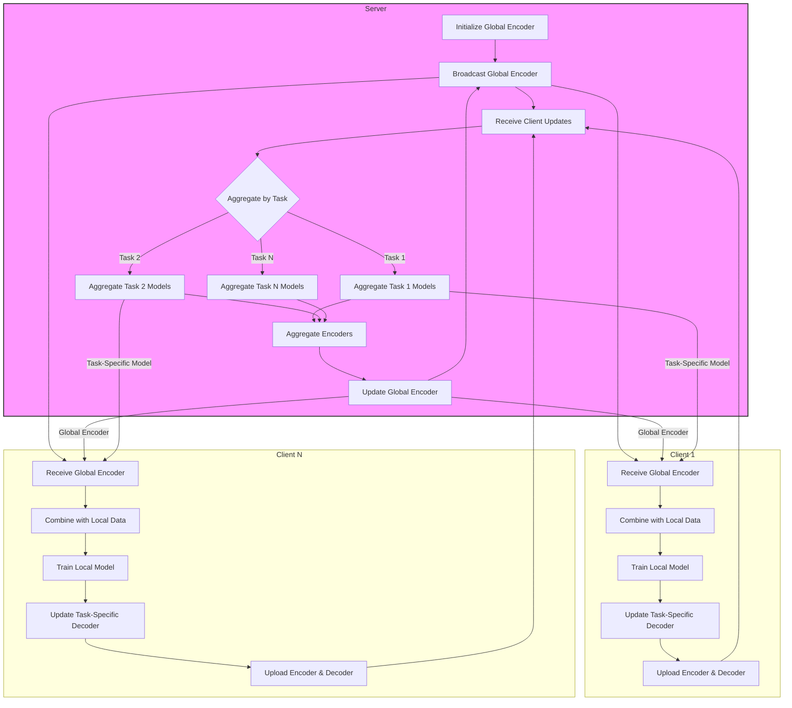

# Multi-Task Federated Learning (MTFL) with Shared Encoder

## Overview
This document outlines a Multi-Task Federated Learning (MTFL) solution that enables collaborative learning across multiple tasks while preserving data privacy. The solution uses a shared encoder with task-specific decoders and implements an adaptive parameter mechanism to balance global and local learning.

## Architecture

### Key Components

1. **Shared Encoder**: A common feature extractor (BERT-tiny) that learns generalizable representations across all tasks.
2. **Task-Specific Decoders**: Individual classifier heads for each task (SST-2, QQP, STSB).
3. **Adaptive Parameter**: Dynamically adjusts the influence of the global encoder based on model convergence.
4. **Two-Level Aggregation**: Combines models both within and across tasks.

## System Pipeline



## Implementation Details

### Model Architecture
```python
class MTLModel(nn.Module):
    def __init__(self, base_model, task_names, lora_config):
        super().__init__()
        # Shared encoder with LoRA
        self.encoder = get_peft_model(base_model, lora_config)
        
        # Task-specific decoders
        self.decoders = nn.ModuleDict({
            task: nn.Linear(base_model.config.hidden_size, get_output_size(task))
            for task in task_names
        })
```

### Adaptive Parameter Controller
```python
class AdaptiveParameter:
    def __init__(self, initial=0.5, min_val=0.1, max_val=1.0, patience=3):
        self.value = initial
        self.min_val = min_val
        self.max_val = max_val
        self.patience = patience
        self.counter = 0
        self.best_loss = float('inf')
    
    def update(self, current_loss):
        if current_loss < self.best_loss:
            self.best_loss = current_loss
            self.counter = 0
            # Increase influence of global encoder
            self.value = min(self.value * 1.1, self.max_val)
        else:
            self.counter += 1
            if self.counter >= self.patience:
                # Decrease influence of global encoder
                self.value = max(self.value * 0.9, self.min_val)
                self.counter = 0
```

## Workflow

1. **Initialization**:
   - Server initializes the global encoder model
   - Clients load their respective task data

2. **Training Round**:
   - Server broadcasts global encoder to all clients
   - Each client:
     - Combines global encoder with local data
     - Trains local model (updating both encoder and task-specific decoder)
     - Tracks model convergence using adaptive parameter
     - Uploads model updates to server

3. **Aggregation**:
   - Server performs two-level aggregation:
     1. Task-level: Averages models within the same task
     2. Global: Averages encoders across all tasks
   - Updates global encoder and task-specific models

4. **Repeat**: Process continues until convergence or maximum rounds reached

## Configuration
Example YAML configuration:
```yaml
model:
  shared_encoder: "prajjwal1/bert-tiny"
  task_specific_heads: true
  
adaptive_parameter:
  initial: 0.5
  min_val: 0.1
  max_val: 1.0
  patience: 3

lora:
  rank: 16
  alpha: 64.0
  dropout: 0.1
```

## Benefits
- **Privacy-Preserving**: Data remains on client devices
- **Efficient**: Shared encoder reduces computational overhead
- **Adaptive**: Dynamic parameter adjustment improves convergence
- **Scalable**: Supports multiple tasks and clients

## Dependencies
- PyTorch
- Transformers
- PEFT (for LoRA)
- PyTorch Lightning (optional, for training utilities)
