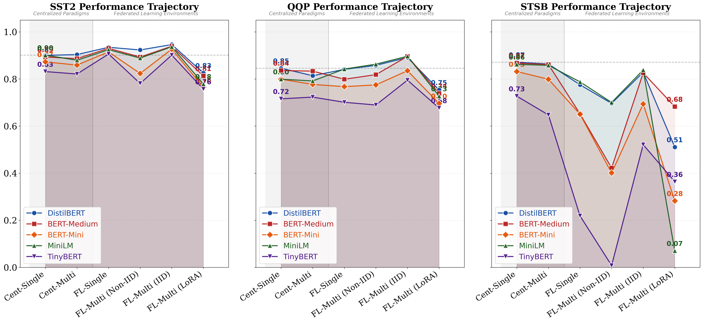

# Advanced Complexity Performance Trajectory Analysis

## Description
Trajectory analysis showing how model performance degrades or improves as we move from Centralized ideal states to complex Federated Multi-Task environments.

## Key Insights
- **Reliability Gap**: Visual drop-off between Centralized and FL configs.
- **MTL Benefit**: Comparison between FL Single and FL Multi Non-IID points.
- **Optimization Impact**: The final point (LoRA) shows recovery in performance despite system complexity.

## Metrics Data

| Configuration | Cent-Single | Cent-Multi | FL-Single | FL-Multi (Non-IID) | FL-Multi (IID) | FL-Multi (LoRA) |
|---|---|---|---|---|---|---|
| DistilBERT-SST2 | 0.9002 | 0.9037 | 0.9346 | 0.9232 | 0.9461 | 0.8257 |
| BERT-Medium-SST2 | 0.8933 | 0.8865 | 0.9300 | 0.8933 | 0.9392 | 0.8131 |
| BERT-Mini-SST2 | 0.8727 | 0.8589 | 0.9151 | 0.8234 | 0.9266 | 0.7649 |
| MiniLM-SST2 | 0.9014 | 0.8796 | 0.9243 | 0.8888 | 0.9369 | 0.7787 |
| TinyBERT-SST2 | 0.8314 | 0.8211 | 0.9060 | 0.7810 | 0.9014 | 0.7569 |
| DistilBERT-QQP | 0.8456 | 0.8137 | 0.8408 | 0.8579 | 0.8913 | 0.7535 |
| BERT-Medium-QQP | 0.8358 | 0.8333 | 0.7989 | 0.8183 | 0.8962 | 0.7388 |
| BERT-Mini-QQP | 0.7990 | 0.7770 | 0.7674 | 0.7748 | 0.8350 | 0.6958 |
| MiniLM-QQP | 0.7990 | 0.7917 | 0.8421 | 0.8629 | 0.8966 | 0.7271 |
| TinyBERT-QQP | 0.7157 | 0.7230 | 0.7010 | 0.6895 | 0.7950 | 0.6766 |
| DistilBERT-STSB | 0.8712 | 0.8635 | 0.7753 | 0.6963 | 0.8284 | 0.5108 |
| BERT-Medium-STSB | 0.8673 | 0.8615 | 0.6521 | 0.4219 | 0.8258 | 0.6823 |
| BERT-Mini-STSB | 0.8316 | 0.7989 | 0.6504 | 0.4009 | 0.6940 | 0.2824 |
| MiniLM-STSB | 0.8620 | 0.8580 | 0.7877 | 0.7003 | 0.8384 | 0.0703 |
| TinyBERT-STSB | 0.7270 | 0.6474 | 0.2186 | 0.0081 | 0.5212 | 0.3636 |

## Data Source
- **File**: master_model_comparison.csv
- **Complexity Stages**: 1. Cent Single, 2. Cent Multi, 3. FL Single, 4. FL Multi Non-IID, 5. FL Multi IID, 6. FL Multi LoRA

---
