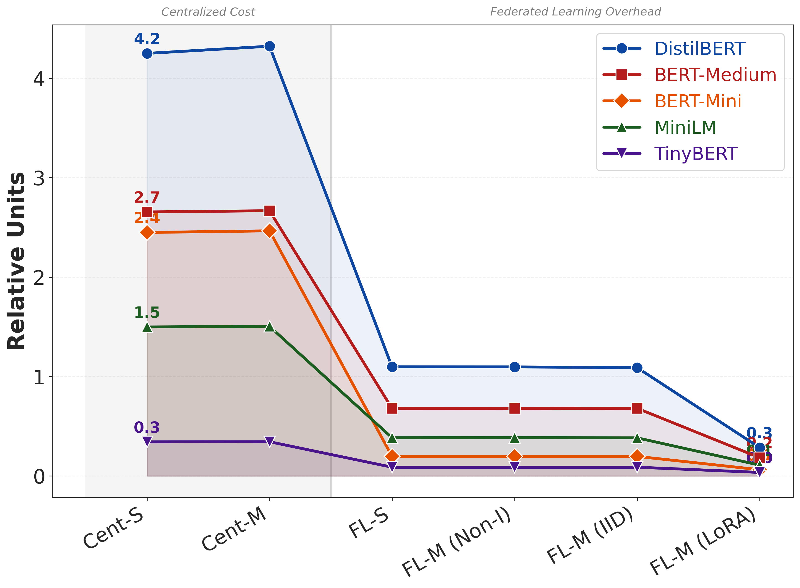

# Resource Usage Trajectory

## Description
How resource usage scales across paradigm complexity.

## Key Insights
Clear visual jump in cost during FL transition.

## Metrics Data

| Configuration | Cent-S | Cent-M | FL-S | FL-M (Non-I) | FL-M (IID) | FL-M (LoRA) |
|---|---|---|---|---|---|---|
| DistilBERT-Overall | 4.2492 | 4.3214 | 1.0972 | 1.0968 | 1.0896 | 0.2852 |
| BERT-Medium-Overall | 2.6549 | 2.6671 | 0.6795 | 0.6790 | 0.6807 | 0.1840 |
| BERT-Mini-Overall | 2.4487 | 2.4651 | 0.1969 | 0.1969 | 0.1969 | 0.0630 |
| MiniLM-Overall | 1.4982 | 1.5045 | 0.3839 | 0.3846 | 0.3835 | 0.1090 |
| TinyBERT-Overall | 0.3427 | 0.3440 | 0.0881 | 0.0881 | 0.0881 | 0.0356 |

## Data Source
- **File**: master_model_comparison.csv
- **Complexity Stages**: 1. Cent Single, 2. Cent Multi, 3. FL Single, 4. FL Multi Non-IID, 5. FL Multi IID, 6. FL Multi LoRA

---
