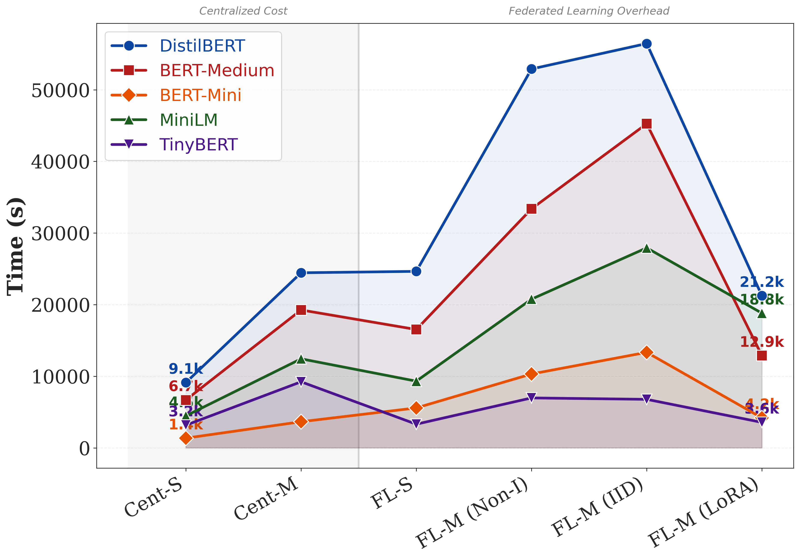

# Training Time Trajectory

## Description
How training time scales across paradigm complexity.

## Key Insights
Clear visual jump in cost during FL transition.

## Metrics Data

| Configuration | Cent-S | Cent-M | FL-S | FL-M (Non-I) | FL-M (IID) | FL-M (LoRA) |
|---|---|---|---|---|---|---|
| DistilBERT-Overall | 9122.3984 | 24449.6803 | 24647.8000 | 52903.9700 | 56454.4600 | 21245.2600 |
| BERT-Medium-Overall | 6693.3213 | 19257.4008 | 16527.2833 | 33374.5000 | 45258.2100 | 12885.7400 |
| BERT-Mini-Overall | 1359.4399 | 3652.5020 | 5580.8133 | 10317.5500 | 13341.0100 | 4191.6700 |
| MiniLM-Overall | 4472.8353 | 12437.1200 | 9316.9100 | 20765.5700 | 27930.0600 | 18808.0800 |
| TinyBERT-Overall | 3169.9611 | 9227.5495 | 3307.5733 | 6975.2800 | 6778.0000 | 3560.6800 |

## Data Source
- **File**: master_model_comparison.csv
- **Complexity Stages**: 1. Cent Single, 2. Cent Multi, 3. FL Single, 4. FL Multi Non-IID, 5. FL Multi IID, 6. FL Multi LoRA

---
