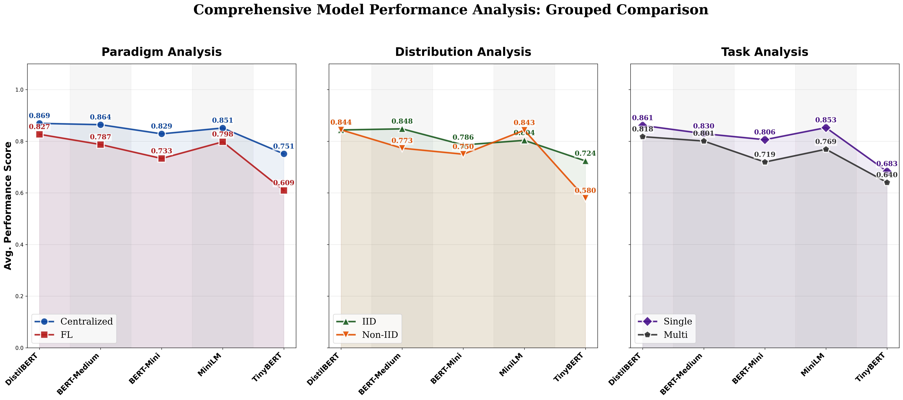

# Line Plot Performance Analysis
    

## Description
Comprehensive performance comparison using grouped line plots to show trends across all six categories (Centralized, FL, IID, Non-IID, Single, Multi). This visualization uses an average performance score derived from GLUE task metrics.

## Performance Metrics Data

| Model | Centralized | FL | IID | Non-IID | Single | Multi |
|---|---|---|---|---|---|---|
| DistilBERT | 0.8693 | 0.8270 | 0.8438 | 0.8441 | 0.8613 | 0.8178 |
| BERT-Medium | 0.8642 | 0.7873 | 0.8481 | 0.7730 | 0.8296 | 0.8009 |
| BERT-Mini | 0.8287 | 0.7331 | 0.7857 | 0.7498 | 0.8060 | 0.7194 |
| MiniLM | 0.8514 | 0.7979 | 0.8036 | 0.8429 | 0.8527 | 0.7691 |
| TinyBERT | 0.7512 | 0.6094 | 0.7238 | 0.5796 | 0.6833 | 0.6404 |

## Data Source
- **File**: master_model_comparison.csv
- **Models**: DistilBERT, BERT-Medium, BERT-Mini, MiniLM, TinyBERT
- **Metric**: Average of Validation SST2/QQP Acc and STSB Pearson
