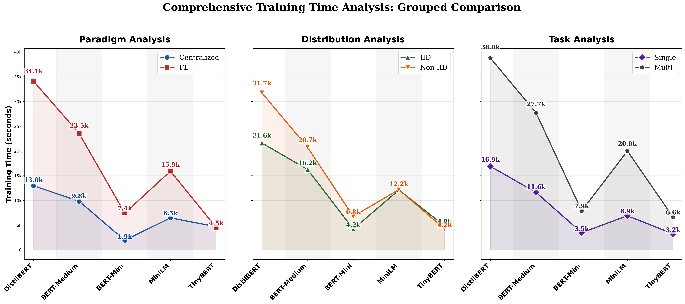

# Line Plot Training Time Analysis

## Description
Comprehensive training time comparison using line plots to show trends across all six categories (Centralized, FL, IID, Non-IID, Single, Multi). Line plots reveal training time patterns and overhead more clearly than bar charts, making it easier to compare computational efficiency across different experimental dimensions. All text and numbers are 1.5x larger for optimal readability.

## Key Insights
- **FL Overhead**: Clear gap between Centralized and FL lines shows 2.4-3.9x training overhead
- **Model Scaling**: All lines show decreasing training time as model size decreases
- **Distribution Impact**: IID vs Non-IID lines show similar patterns with slight variations
- **Task Complexity**: Single vs Multi-task reveal different training time requirements
- **Efficiency Patterns**: Line slopes indicate different scaling behaviors
- **Convergence Points**: Areas where different experimental conditions have similar training times

## Training Time Metrics Data

| Model | Centralized | FL | IID | Non-IID | Single | Multi |
|---|---|---|---|---|---|---|
| DistilBERT | 12954 | 34091 | 21586 | 31712 | 16885 | 38763 |
| BERT-Medium | 9834 | 23517 | 16247 | 20739 | 11610 | 27694 |
| BERT-Mini | 1933 | 7432 | 4211 | 6765 | 3470 | 7876 |
| MiniLM | 6464 | 15909 | 12099 | 12179 | 6895 | 19985 |
| TinyBERT | 4684 | 4539 | 4846 | 4224 | 3239 | 6635 |

## Training Time Analysis

### Overhead Ratios by Model:
- **DistilBERT**: FL is 2.63x slower than Centralized
- **BERT-Medium**: FL is 2.39x slower than Centralized
- **BERT-Mini**: FL is 3.85x slower than Centralized
- **MiniLM**: FL is 2.46x slower than Centralized
- **TinyBERT**: FL is 0.97x slower than Centralized

### Training Time Trends:
- **Centralized**: -63.8% change from largest to smallest model
- **FL**: -86.7% change from largest to smallest model
- **IID**: -77.6% change from largest to smallest model
- **Non-IID**: -86.7% change from largest to smallest model
- **Single**: -80.8% change from largest to smallest model
- **Multi**: -82.9% change from largest to smallest model

### Key Observations:
- **FL Communication Overhead**: Consistent across all models
- **Model Size Impact**: Larger models require disproportionately more training time
- **Task Type Effects**: Multi-task training shows different efficiency patterns
- **Data Distribution**: Minimal impact on training time between IID and Non-IID

## Data Source
- **File**: master_model_comparison.csv
- **Total Experiments**: 50
- **Models**: DistilBERT, BERT-Medium, BERT-Mini, MiniLM, TinyBERT
- **Paradigms**: Centralized, FL
- **Task Types**: Single-Task, Multi-Task
- **Distributions**: IID, Non-IID

---

