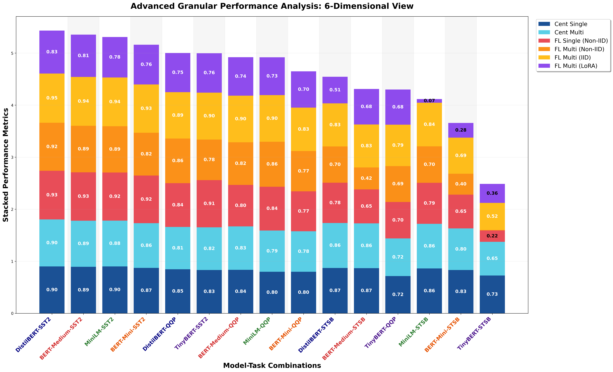

# Advanced 6-Way Granular Performance Analysis

## Description
Highly granular 6-way stacked performance comparison across Centralized baselines, FL Single/Multi-task settings, data distributions (IID/Non-IID), and optimization techniques (LoRA).

## Key Insights
- **Paradigm Baseline**: Centralized Single/Multi (Blues) provide the theoretical upper bounds.
- **Distribution Impact**: Compare FL Multi Non-IID (Orange) vs IID (Yellow) to see data heterogeneity effects.
- **MTL Efficiency**: FL Multi Non-IID performance compared to FL Single Non-IID (Red).
- **Optimization (LoRA)**: The Purple segment demonstrates the viability of LoRA in Federated Multi-Task learning.

## Metrics Data

| Model | Task | Cent_Single | Cent_Multi | FL_Single_NonIID | FL_Multi_NonIID | FL_Multi_IID | FL_Multi_LoRA | Total |
|---|---|---|---|---|---|---|---|---|
| DistilBERT | SST2 | 0.9002 | 0.9037 | 0.9346 | 0.9232 | 0.9461 | 0.8257 | 5.4335 |
| BERT-Medium | SST2 | 0.8933 | 0.8865 | 0.9300 | 0.8933 | 0.9392 | 0.8131 | 5.3554 |
| MiniLM | SST2 | 0.9014 | 0.8796 | 0.9243 | 0.8888 | 0.9369 | 0.7787 | 5.3097 |
| BERT-Mini | SST2 | 0.8727 | 0.8589 | 0.9151 | 0.8234 | 0.9266 | 0.7649 | 5.1617 |
| DistilBERT | QQP | 0.8456 | 0.8137 | 0.8408 | 0.8579 | 0.8913 | 0.7535 | 5.0028 |
| TinyBERT | SST2 | 0.8314 | 0.8211 | 0.9060 | 0.7810 | 0.9014 | 0.7569 | 4.9978 |
| BERT-Medium | QQP | 0.8358 | 0.8333 | 0.7989 | 0.8183 | 0.8962 | 0.7388 | 4.9213 |
| MiniLM | QQP | 0.7990 | 0.7917 | 0.8421 | 0.8629 | 0.8966 | 0.7271 | 4.9194 |
| BERT-Mini | QQP | 0.7990 | 0.7770 | 0.7674 | 0.7748 | 0.8350 | 0.6958 | 4.6490 |
| DistilBERT | STSB | 0.8712 | 0.8635 | 0.7753 | 0.6963 | 0.8284 | 0.5108 | 4.5455 |
| BERT-Medium | STSB | 0.8673 | 0.8615 | 0.6521 | 0.4219 | 0.8258 | 0.6823 | 4.3109 |
| TinyBERT | QQP | 0.7157 | 0.7230 | 0.7010 | 0.6895 | 0.7950 | 0.6766 | 4.3008 |
| MiniLM | STSB | 0.8620 | 0.8580 | 0.7877 | 0.7003 | 0.8384 | 0.0703 | 4.1167 |
| BERT-Mini | STSB | 0.8316 | 0.7989 | 0.6504 | 0.4009 | 0.6940 | 0.2824 | 3.6582 |
| TinyBERT | STSB | 0.7270 | 0.6474 | 0.2186 | 0.0081 | 0.5212 | 0.3636 | 2.4859 |

## Data Source
- **File**: master_model_comparison.csv
- **Total Experiments**: 50
- **Analysis Dimensions**: Paradigm, Task Type, Distribution, Optimization (LoRA)

---
