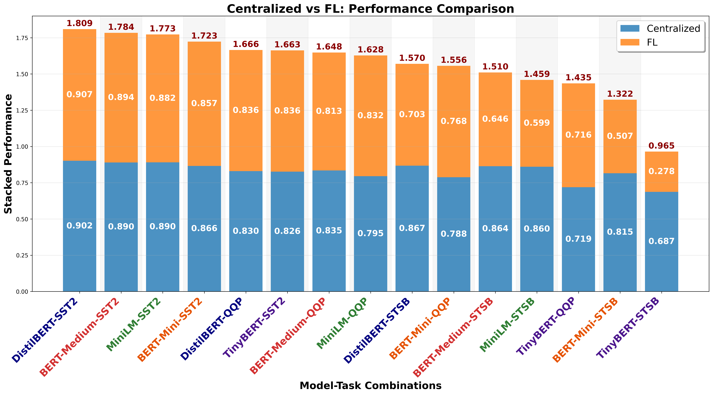

# Centralized vs FL: Performance Comparison

## Description
Performance comparison between Centralized and Federated Learning (FL) paradigms. All text and numbers are 1.5x larger for optimal readability.

## Key Insights
- **Performance Hierarchy**: Clear ranking of model-task combinations by total performance
- **Paradigm Contribution**: Visual representation of each paradigm's contribution to total
- **Top Performers**: Best configurations show strong performance from both paradigms
- **Task Patterns**: Different tasks show different paradigm dominance patterns

## Metrics Data

| Model | Task | Centralized | FL | Total | Difference | Percent_Diff |
|---|---|---|---|---|---|---|
| DistilBERT | SST2 | 0.9019 | 0.9074 | 1.8093 | 0.0055 | 0.6043 |
| BERT-Medium | SST2 | 0.8899 | 0.8939 | 1.7838 | 0.0040 | 0.4486 |
| MiniLM | SST2 | 0.8905 | 0.8822 | 1.7727 | -0.0083 | -0.9328 |
| BERT-Mini | SST2 | 0.8658 | 0.8575 | 1.7233 | -0.0083 | -0.9616 |
| DistilBERT | QQP | 0.8297 | 0.8359 | 1.6655 | 0.0062 | 0.7495 |
| TinyBERT | SST2 | 0.8263 | 0.8363 | 1.6626 | 0.0101 | 1.2180 |
| BERT-Medium | QQP | 0.8346 | 0.8130 | 1.6476 | -0.0215 | -2.5773 |
| MiniLM | QQP | 0.7953 | 0.8322 | 1.6275 | 0.0368 | 4.6309 |
| DistilBERT | STSB | 0.8674 | 0.7027 | 1.5701 | -0.1647 | -18.9834 |
| BERT-Mini | QQP | 0.7880 | 0.7682 | 1.5562 | -0.0197 | -2.5051 |
| BERT-Medium | STSB | 0.8644 | 0.6455 | 1.5099 | -0.2189 | -25.3219 |
| MiniLM | STSB | 0.8600 | 0.5992 | 1.4592 | -0.2608 | -30.3269 |
| TinyBERT | QQP | 0.7194 | 0.7155 | 1.4349 | -0.0038 | -0.5335 |
| BERT-Mini | STSB | 0.8152 | 0.5069 | 1.3222 | -0.3083 | -37.8191 |
| TinyBERT | STSB | 0.6872 | 0.2779 | 0.9651 | -0.4093 | -59.5649 |

## Data Source
- **File**: master_model_comparison.csv
- **Total Experiments**: 50
- **Models**: DistilBERT, BERT-Medium, BERT-Mini, MiniLM, TinyBERT
- **Paradigms**: Centralized, FL
- **Task Types**: Single-Task, Multi-Task
- **Distributions**: IID, Non-IID

---
