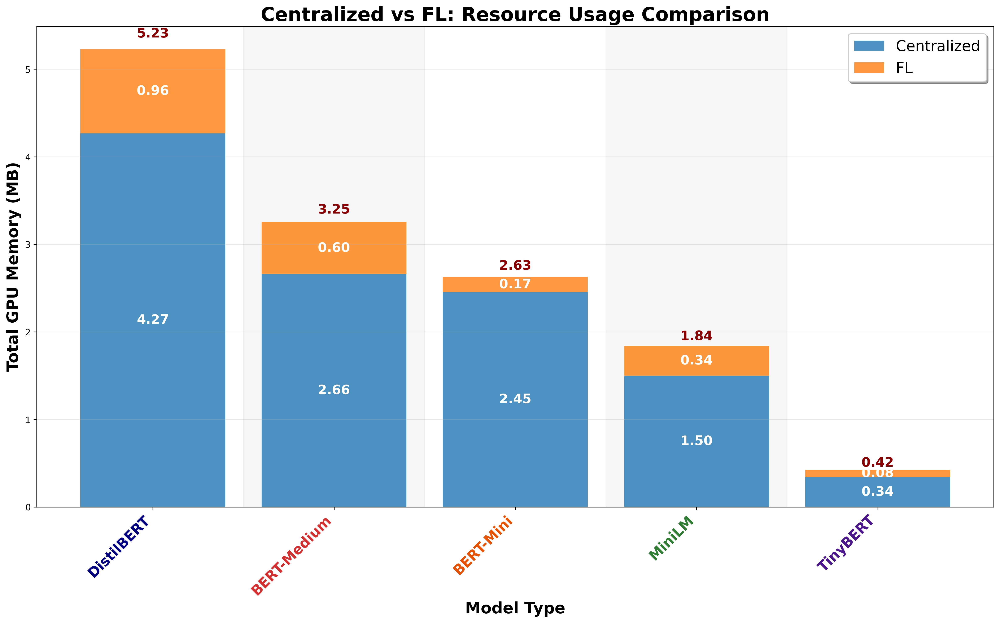

# Centralized vs FL: Resource Usage Comparison

## Description
Resource usage comparison between Centralized and Federated Learning (FL) paradigms. All text and numbers are 1.5x larger for optimal readability.

## Key Insights
- **Resource Hierarchy**: Clear ranking of models by total resource requirements
- **FL Efficiency**: Visual representation of FL's distributed resource efficiency
- **Model Scaling**: Resource usage patterns across different model sizes
- **Deployment Patterns**: Different resource requirements for each paradigm

## Metrics Data

| Model | Centralized | FL | Total | Ratio | Difference |
|---|---|---|---|---|---|
| DistilBERT | 4.2673 | 0.9605 | 5.2278 | 0.2251 | -3.3067 |
| BERT-Medium | 2.6579 | 0.5970 | 3.2549 | 0.2246 | -2.0609 |
| BERT-Mini | 2.4528 | 0.1745 | 2.6274 | 0.0712 | -2.2783 |
| MiniLM | 1.4998 | 0.3381 | 1.8379 | 0.2255 | -1.1616 |
| TinyBERT | 0.3431 | 0.0793 | 0.4224 | 0.2313 | -0.2637 |

## Data Source
- **File**: master_model_comparison.csv
- **Total Experiments**: 50
- **Models**: DistilBERT, BERT-Medium, BERT-Mini, MiniLM, TinyBERT
- **Paradigms**: Centralized, FL
- **Task Types**: Single-Task, Multi-Task
- **Distributions**: IID, Non-IID

---
