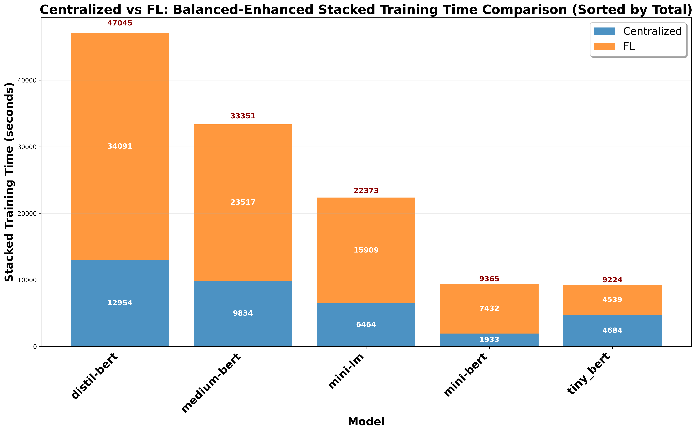

# Centralized vs FL: Balanced-Enhanced Stacked Training Time Comparison

## Description
Balanced-enhanced stacked training time comparison between Centralized and Federated Learning (FL) paradigms. All text and numbers are 1.5x larger for optimal readability.

## Key Insights
- **Time Hierarchy**: Clear ranking of models by total training requirements
- **FL Overhead**: Visual representation of FL's additional training time
- **Model Scaling**: Larger models require more time for both paradigms
- **Efficiency Patterns**: Different models show different time ratios

## Metrics Data

| Model | Centralized | FL | Total | Ratio | Difference |
|---|---|---|---|---|---|
| distil-bert | 12954.2189 | 34091.1817 | 47045.4005 | 2.6317 | 21136.9628 |
| medium-bert | 9834.3412 | 23516.7167 | 33351.0578 | 2.3913 | 13682.3755 |
| mini-lm | 6463.9064 | 15909.0733 | 22372.9798 | 2.4612 | 9445.1669 |
| mini-bert | 1932.7054 | 7432.1117 | 9364.8171 | 3.8454 | 5499.4062 |
| tiny_bert | 4684.3582 | 4539.4467 | 9223.8048 | 0.9691 | -144.9115 |

## Data Source
- **File**: master_model_comparison.csv
- **Total Experiments**: 50
- **Models**: distil-bert, medium-bert, mini-bert, mini-lm, tiny_bert
- **Paradigms**: Centralized, FL
- **Task Types**: Single-Task, Multi-Task (MTL)
- **Distributions**: IID, Non-IID

---
