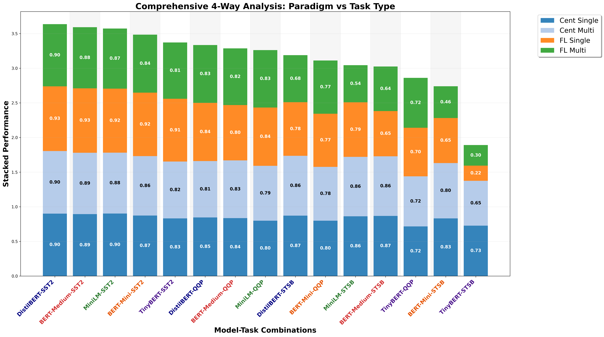

# Comprehensive Paradigm vs Task Performance Analysis

## Description
Ultimate 4-way stacked performance comparison: Centralized Single-Task vs Centralized Multi-Task vs FL Single-Task vs FL Multi-Task. This summarizes how both paradigms and task types interact across models.

## Key Insights
- **Paradigm Dominance**: Centralized (Blues) vs FL (Orange/Green) performance gaps are clearly visualized.
- **Task Type Impact**: Compare light blue vs dark blue and green vs orange to see MTL effects in each paradigm.
- **Overall Scaling**: Shows which models maintain performance best across all four rigorous conditions.

## Metrics Data

| Model | Task | Cent_Single | Cent_Multi | FL_Single | FL_Multi | Total |
|---|---|---|---|---|---|---|
| DistilBERT | SST2 | 0.9002 | 0.9037 | 0.9346 | 0.8983 | 3.6368 |
| BERT-Medium | SST2 | 0.8933 | 0.8865 | 0.9300 | 0.8819 | 3.5917 |
| MiniLM | SST2 | 0.9014 | 0.8796 | 0.9243 | 0.8681 | 3.5734 |
| BERT-Mini | SST2 | 0.8727 | 0.8589 | 0.9151 | 0.8383 | 3.4851 |
| TinyBERT | SST2 | 0.8314 | 0.8211 | 0.9060 | 0.8131 | 3.3716 |
| DistilBERT | QQP | 0.8456 | 0.8137 | 0.8408 | 0.8342 | 3.3343 |
| BERT-Medium | QQP | 0.8358 | 0.8333 | 0.7989 | 0.8178 | 3.2858 |
| MiniLM | QQP | 0.7990 | 0.7917 | 0.8421 | 0.8289 | 3.2617 |
| DistilBERT | STSB | 0.8712 | 0.8635 | 0.7753 | 0.6785 | 3.1885 |
| BERT-Mini | QQP | 0.7990 | 0.7770 | 0.7674 | 0.7685 | 3.1119 |
| MiniLM | STSB | 0.8620 | 0.8580 | 0.7877 | 0.5363 | 3.0440 |
| BERT-Medium | STSB | 0.8673 | 0.8615 | 0.6521 | 0.6433 | 3.0243 |
| TinyBERT | QQP | 0.7157 | 0.7230 | 0.7010 | 0.7204 | 2.8601 |
| BERT-Mini | STSB | 0.8316 | 0.7989 | 0.6504 | 0.4591 | 2.7400 |
| TinyBERT | STSB | 0.7270 | 0.6474 | 0.2186 | 0.2976 | 1.8907 |

## Data Source
- **File**: master_model_comparison.csv
- **Total Experiments**: 50
- **Models**: DistilBERT, BERT-Medium, BERT-Mini, MiniLM, TinyBERT
- **Paradigms**: Centralized, FL
- **Task Types**: Single-Task, Multi-Task
- **Distributions**: IID, Non-IID

---
