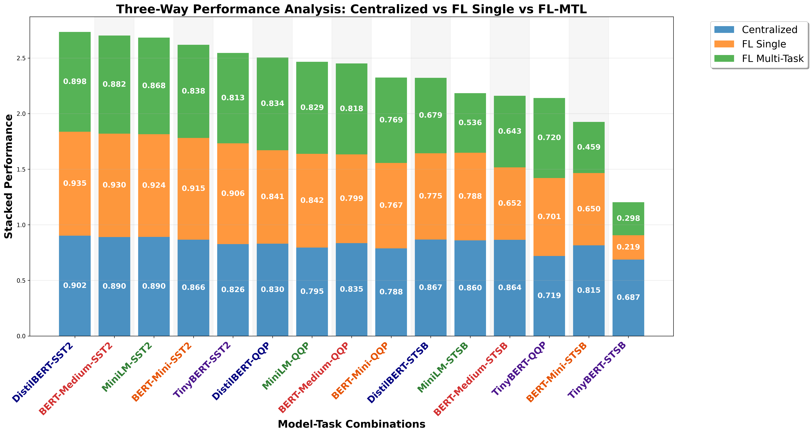

# FL-MTL Performance Comparison Analysis

## Description
Three-way stacked performance comparison between Centralized baseline, FL Single-Task, and FL Multi-Task (MTL). This visualization highlights the performance gaps and gains when moving from single-task to multi-task learning in a federated environment.

## Key Insights
- **Baseline Comparison**: Centralized remains the upper bound for most model-task pairs.
- **MTL Impact**: The third segment (Green) shows the contribution of Multi-Task Learning in FL settings.
- **Model Sensitivity**: Different models respond differently to the transition from single to multi-task in FL.

## Metrics Data

| Model | Task | Centralized | FL_Single | FL_Multi | Total |
|---|---|---|---|---|---|
| DistilBERT | SST2 | 0.9019 | 0.9346 | 0.8983 | 2.7349 |
| BERT-Medium | SST2 | 0.8899 | 0.9300 | 0.8819 | 2.7018 |
| MiniLM | SST2 | 0.8905 | 0.9243 | 0.8681 | 2.6829 |
| BERT-Mini | SST2 | 0.8658 | 0.9151 | 0.8383 | 2.6192 |
| TinyBERT | SST2 | 0.8263 | 0.9060 | 0.8131 | 2.5454 |
| DistilBERT | QQP | 0.8297 | 0.8408 | 0.8342 | 2.5047 |
| MiniLM | QQP | 0.7953 | 0.8421 | 0.8289 | 2.4663 |
| BERT-Medium | QQP | 0.8346 | 0.7989 | 0.8178 | 2.4512 |
| BERT-Mini | QQP | 0.7880 | 0.7674 | 0.7685 | 2.3239 |
| DistilBERT | STSB | 0.8674 | 0.7753 | 0.6785 | 2.3212 |
| MiniLM | STSB | 0.8600 | 0.7877 | 0.5363 | 2.1840 |
| BERT-Medium | STSB | 0.8644 | 0.6521 | 0.6433 | 2.1598 |
| TinyBERT | QQP | 0.7194 | 0.7010 | 0.7204 | 2.1407 |
| BERT-Mini | STSB | 0.8152 | 0.6504 | 0.4591 | 1.9247 |
| TinyBERT | STSB | 0.6872 | 0.2186 | 0.2976 | 1.2034 |

## Data Source
- **File**: master_model_comparison.csv
- **Total Experiments**: 50
- **Models**: DistilBERT, BERT-Medium, BERT-Mini, MiniLM, TinyBERT
- **Paradigms**: Centralized, FL
- **Task Types**: Single-Task, Multi-Task
- **Distributions**: IID, Non-IID

---
