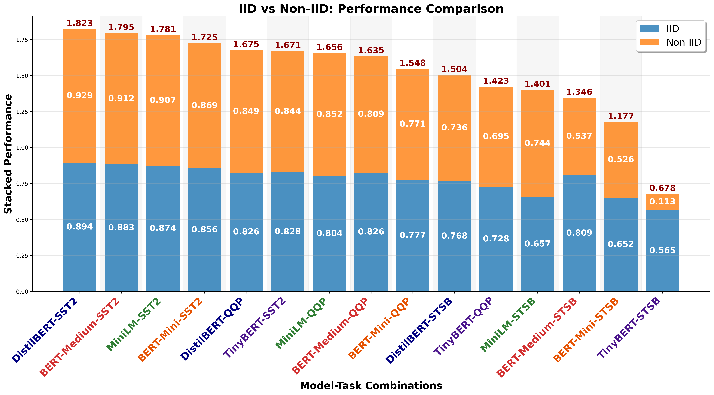

# IID vs Non-IID: Performance Comparison

## Description
Performance comparison between IID and Non-IID data distributions. All text and numbers are 1.5x larger for optimal readability.

## Key Insights
- **Performance Hierarchy**: Clear ranking of model-task combinations by total performance
- **Distribution Impact**: Visual representation of each distribution's contribution to total
- **Robustness Patterns**: Height ratios indicate model robustness to distribution shifts
- **Task Sensitivity**: Different tasks show different IID vs Non-IID balance

## Metrics Data

| Model | Task | IID | Non-IID | Total | Degradation | Percent_Degrad |
|---|---|---|---|---|---|---|
| DistilBERT | SST2 | 0.8939 | 0.9289 | 1.8228 | -0.0350 | -3.9125 |
| BERT-Medium | SST2 | 0.8830 | 0.9117 | 1.7947 | -0.0286 | -3.2412 |
| MiniLM | SST2 | 0.8741 | 0.9065 | 1.7807 | -0.0324 | -3.7075 |
| BERT-Mini | SST2 | 0.8558 | 0.8693 | 1.7250 | -0.0135 | -1.5731 |
| DistilBERT | QQP | 0.8260 | 0.8494 | 1.6754 | -0.0233 | -2.8233 |
| TinyBERT | SST2 | 0.8277 | 0.8435 | 1.6712 | -0.0158 | -1.9082 |
| MiniLM | QQP | 0.8036 | 0.8525 | 1.6561 | -0.0489 | -6.0856 |
| BERT-Medium | QQP | 0.8260 | 0.8086 | 1.6346 | 0.0174 | 2.1100 |
| BERT-Mini | QQP | 0.7767 | 0.7711 | 1.5478 | 0.0056 | 0.7204 |
| DistilBERT | STSB | 0.7685 | 0.7358 | 1.5043 | 0.0327 | 4.2521 |
| TinyBERT | QQP | 0.7276 | 0.6952 | 1.4228 | 0.0323 | 4.4437 |
| MiniLM | STSB | 0.6572 | 0.7440 | 1.4012 | -0.0868 | -13.2136 |
| BERT-Medium | STSB | 0.8092 | 0.5370 | 1.3462 | 0.2722 | 33.6406 |
| BERT-Mini | STSB | 0.6517 | 0.5256 | 1.1774 | 0.1261 | 19.3443 |
| TinyBERT | STSB | 0.5648 | 0.1133 | 0.6782 | 0.4515 | 79.9312 |

## Data Source
- **File**: master_model_comparison.csv
- **Total Experiments**: 50
- **Models**: DistilBERT, BERT-Medium, BERT-Mini, MiniLM, TinyBERT
- **Paradigms**: Centralized, FL
- **Task Types**: Single-Task, Multi-Task
- **Distributions**: IID, Non-IID

---
