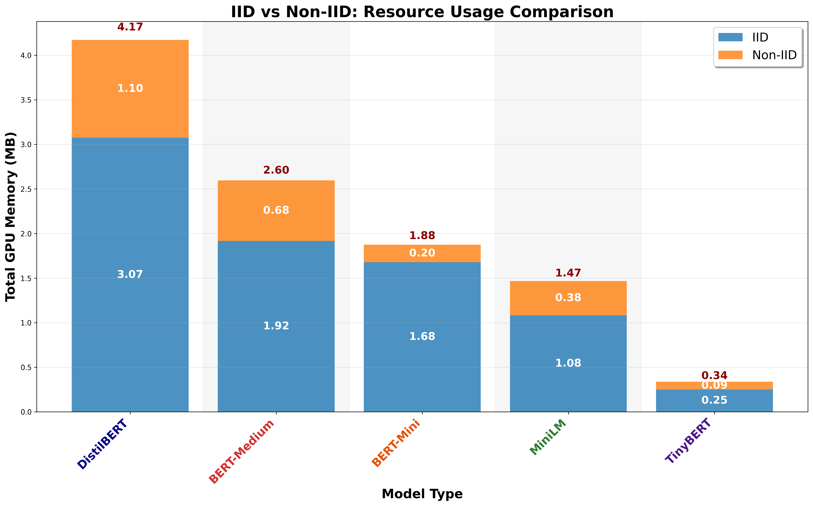

# IID vs Non-IID: Resource Usage Comparison

## Description
Resource usage comparison between IID and Non-IID data distributions. All text and numbers are 1.5x larger for optimal readability.

## Key Insights
- **Resource Scaling**: Different models show different resource requirements
- **Distribution Impact**: Visual representation of Non-IID resource efficiency
- **Model Adaptation**: Resource usage patterns with distribution complexity
- **Efficiency Patterns**: Some models handle Non-IID more resource-efficiently

## Metrics Data

| Model | IID | Non-IID | Total | Ratio | Difference |
|---|---|---|---|---|---|
| DistilBERT | 3.0740 | 1.0971 | 4.1711 | 0.3569 | -1.9769 |
| BERT-Medium | 1.9161 | 0.6794 | 2.5954 | 0.3546 | -1.2367 |
| BERT-Mini | 1.6785 | 0.1969 | 1.8754 | 0.1173 | -1.4817 |
| MiniLM | 1.0819 | 0.3841 | 1.4660 | 0.3550 | -0.6978 |
| TinyBERT | 0.2493 | 0.0881 | 0.3374 | 0.3533 | -0.1612 |

## Data Source
- **File**: master_model_comparison.csv
- **Total Experiments**: 50
- **Models**: DistilBERT, BERT-Medium, BERT-Mini, MiniLM, TinyBERT
- **Paradigms**: Centralized, FL
- **Task Types**: Single-Task, Multi-Task
- **Distributions**: IID, Non-IID

---
