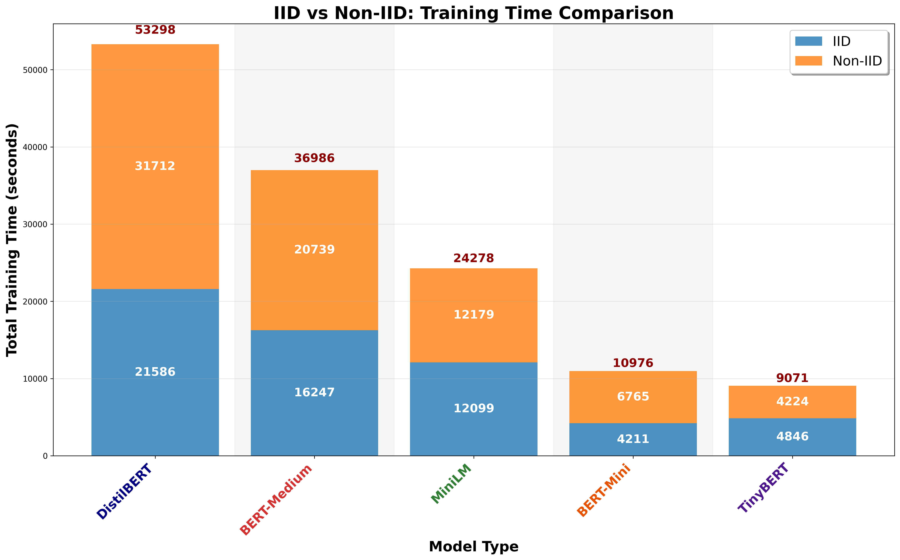

# IID vs Non-IID: Training Time Comparison

## Description
Training time comparison between IID and Non-IID data distributions. All text and numbers are 1.5x larger for optimal readability.

## Key Insights
- **Convergence Patterns**: Different models show different convergence requirements
- **Distribution Impact**: Visual representation of Non-IID training overhead
- **Model Adaptation**: Training time scaling with distribution complexity
- **Efficiency Patterns**: Some models handle Non-IID more efficiently

## Metrics Data

| Model | IID | Non-IID | Total | Ratio | Difference |
|---|---|---|---|---|---|
| DistilBERT | 21586.0992 | 31711.8425 | 53297.9417 | 1.4691 | 10125.7433 |
| BERT-Medium | 16246.8858 | 20739.0875 | 36985.9733 | 1.2765 | 4492.2017 |
| MiniLM | 12098.9610 | 12179.0750 | 24278.0360 | 1.0066 | 80.1140 |
| BERT-Mini | 4210.5836 | 6764.9975 | 10975.5811 | 1.6067 | 2554.4139 |
| TinyBERT | 4846.0188 | 4224.5000 | 9070.5188 | 0.8717 | -621.5188 |

## Data Source
- **File**: master_model_comparison.csv
- **Total Experiments**: 50
- **Models**: DistilBERT, BERT-Medium, BERT-Mini, MiniLM, TinyBERT
- **Paradigms**: Centralized, FL
- **Task Types**: Single-Task, Multi-Task
- **Distributions**: IID, Non-IID

---
