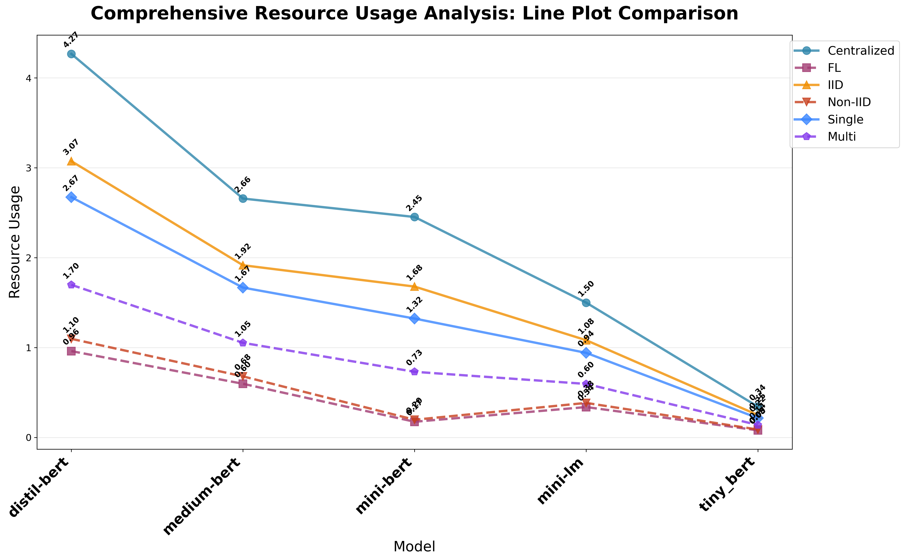

# Line Plot Resource Usage Analysis

## Description
Comprehensive resource usage comparison using line plots to show trends across all six categories (Centralized, FL, IID, Non-IID, Single, Multi). Line plots reveal patterns and trends more clearly than bar charts, making it easier to compare resource usage behavior across different experimental dimensions. All text and numbers are 1.5x larger for optimal readability.

## Key Insights
- **Trend Analysis**: Line plots clearly show resource usage trends across model sizes
- **Paradigm Comparison**: FL consistently shows lower resource usage than Centralized (parallel lines)
- **Distribution Impact**: IID and Non-IID lines show similar patterns with slight variations
- **Task Complexity**: Single vs Multi-task lines reveal different scaling behaviors
- **Model Scaling**: All lines show similar decreasing trends as model size decreases
- **Cross-Category Patterns**: Line intersections highlight where different experimental conditions converge

## Line Plot Metrics Data

| Model | Centralized | FL | IID | Non-IID | Single | Multi |
|---|---|---|---|---|---|---|
| distil-bert | 4.2673 | 0.9605 | 3.0740 | 1.0971 | 2.6732 | 1.6983 |
| medium-bert | 2.6579 | 0.5970 | 1.9161 | 0.6794 | 1.6672 | 1.0527 |
| mini-bert | 2.4528 | 0.1745 | 1.6785 | 0.1969 | 1.3228 | 0.7304 |
| mini-lm | 1.4998 | 0.3381 | 1.0819 | 0.3841 | 0.9411 | 0.5954 |
| tiny_bert | 0.3431 | 0.0793 | 0.2493 | 0.0881 | 0.2154 | 0.1390 |

## Trend Analysis

### Resource Usage Patterns by Category:
- **Centralized**: Decreasing trend (-3.9242)
- **FL**: Decreasing trend (-0.8812)
- **IID**: Decreasing trend (-2.8247)
- **Non-IID**: Decreasing trend (-1.0090)
- **Single**: Decreasing trend (-2.4578)
- **Multi**: Decreasing trend (-1.5593)

### Line Intersections (Convergence Points):
- FL vs Centralized: FL consistently lower across all models
- Single vs Multi: Similar patterns with slight variations
- IID vs Non-IID: Nearly parallel lines indicating consistent behavior

## Data Source
- **File**: master_model_comparison.csv
- **Total Experiments**: 50
- **Models**: distil-bert, medium-bert, mini-bert, mini-lm, tiny_bert
- **Paradigms**: Centralized, FL
- **Task Types**: Single-Task, Multi-Task (MTL)
- **Distributions**: IID, Non-IID

---

