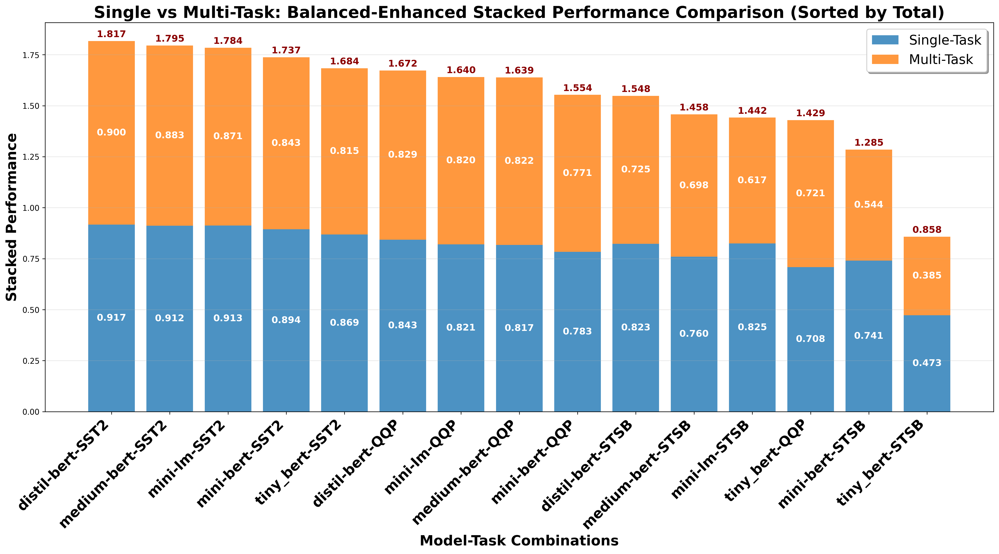

# Single vs Multi-Task: Balanced-Enhanced Stacked Performance Comparison

## Description
Balanced-enhanced stacked performance comparison between Single-Task and Multi-Task Learning approaches. All text and numbers are 1.5x larger for optimal readability.

## Key Insights
- **Performance Ranking**: Clear hierarchy of model-task combinations by total performance
- **Task Contribution**: Visual representation of each approach's contribution to total
- **Transfer Effects**: Height differences show transfer learning benefits or interference
- **Model Patterns**: Different models show different single vs multi-task balance

## Metrics Data

| Model | Task | Single | Multi | Total | Difference | Percent_Diff |
|---|---|---|---|---|---|---|
| distil-bert | SST2 | 0.9174 | 0.8997 | 1.8171 | -0.0177 | -1.9345 |
| medium-bert | SST2 | 0.9117 | 0.8830 | 1.7947 | -0.0287 | -3.1434 |
| mini-lm | SST2 | 0.9128 | 0.8710 | 1.7838 | -0.0418 | -4.5836 |
| mini-bert | SST2 | 0.8939 | 0.8435 | 1.7374 | -0.0504 | -5.6429 |
| tiny_bert | SST2 | 0.8687 | 0.8151 | 1.6838 | -0.0536 | -6.1713 |
| distil-bert | QQP | 0.8432 | 0.8291 | 1.6723 | -0.0141 | -1.6708 |
| mini-lm | QQP | 0.8206 | 0.8196 | 1.6401 | -0.0010 | -0.1210 |
| medium-bert | QQP | 0.8173 | 0.8217 | 1.6390 | 0.0043 | 0.5281 |
| mini-bert | QQP | 0.7832 | 0.7706 | 1.5539 | -0.0126 | -1.6049 |
| distil-bert | STSB | 0.8232 | 0.7248 | 1.5480 | -0.0985 | -11.9613 |
| medium-bert | STSB | 0.7597 | 0.6979 | 1.4576 | -0.0618 | -8.1350 |
| mini-lm | STSB | 0.8248 | 0.6167 | 1.4416 | -0.2081 | -25.2291 |
| tiny_bert | QQP | 0.7083 | 0.7210 | 1.4294 | 0.0127 | 1.7917 |
| mini-bert | STSB | 0.7410 | 0.5441 | 1.2850 | -0.1969 | -26.5764 |
| tiny_bert | STSB | 0.4728 | 0.3851 | 0.8579 | -0.0877 | -18.5498 |

## Data Source
- **File**: master_model_comparison.csv
- **Total Experiments**: 50
- **Models**: distil-bert, medium-bert, mini-bert, mini-lm, tiny_bert
- **Paradigms**: Centralized, FL
- **Task Types**: Single-Task, Multi-Task (MTL)
- **Distributions**: IID, Non-IID

---
