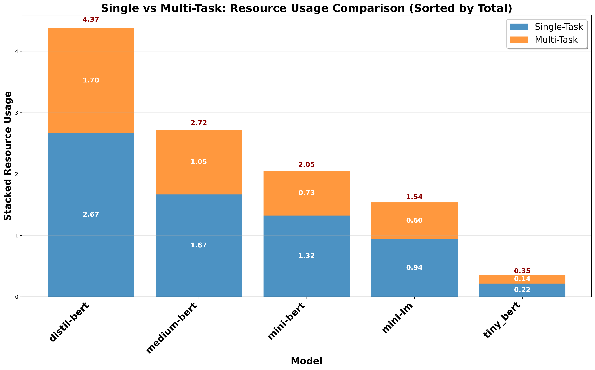

# Single vs Multi-Task: Resource Usage Comparison

## Description
Resource usage comparison between Single-Task and Multi-Task Learning approaches. All text and numbers are 1.5x larger for optimal readability.

## Key Insights
- **Resource Efficiency**: Clear ranking of models by total resource consumption
- **Multi-Task Benefits**: Visual representation of shared parameter efficiency
- **Model Patterns**: Different models show different resource scaling
- **Deployment Considerations**: Resource requirements for different task configurations

## Metrics Data

| Model | Single | Multi | Total | Ratio | Difference |
|---|---|---|---|---|---|
| distil-bert | 2.6732 | 1.6983 | 4.3715 | 0.6353 | -0.9750 |
| medium-bert | 1.6672 | 1.0527 | 2.7199 | 0.6314 | -0.6145 |
| mini-bert | 1.3228 | 0.7304 | 2.0532 | 0.5522 | -0.5923 |
| mini-lm | 0.9411 | 0.5954 | 1.5364 | 0.6326 | -0.3457 |
| tiny_bert | 0.2154 | 0.1390 | 0.3544 | 0.6451 | -0.0764 |

## Data Source
- **File**: master_model_comparison.csv
- **Total Experiments**: 50
- **Models**: distil-bert, medium-bert, mini-bert, mini-lm, tiny_bert
- **Paradigms**: Centralized, FL
- **Task Types**: Single-Task, Multi-Task (MTL)
- **Distributions**: IID, Non-IID

---
