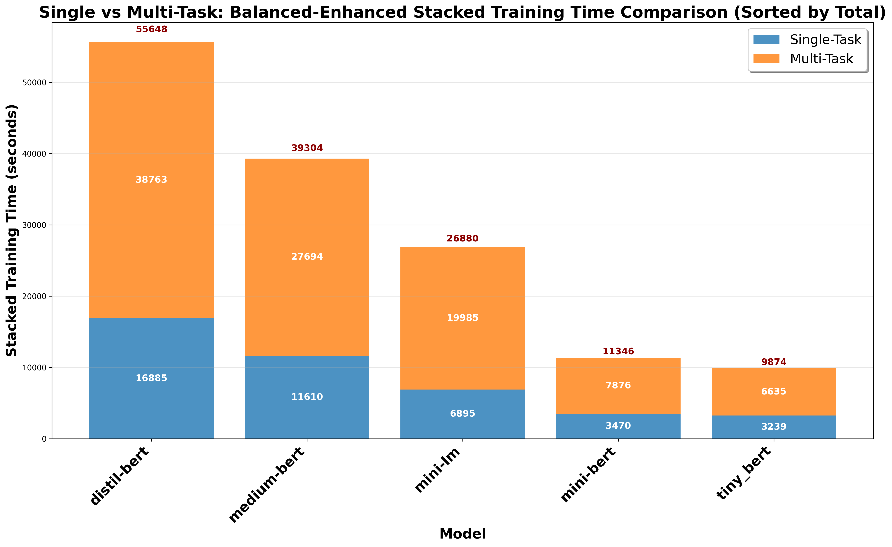

# Single vs Multi-Task: Balanced-Enhanced Stacked Training Time Comparison

## Description
Balanced-enhanced stacked training time comparison between Single-Task and Multi-Task Learning approaches. All text and numbers are 1.5x larger for optimal readability.

## Key Insights
- **Time Requirements**: Clear ranking of models by total training needs
- **Multi-Task Efficiency**: Visual representation of multi-task training overhead
- **Model Patterns**: Different models show different single vs multi-task time ratios
- **Scalability Effects**: Training time scaling patterns across model sizes

## Metrics Data

| Model | Single | Multi | Total | Ratio | Difference |
|---|---|---|---|---|---|
| distil-bert | 16885.0992 | 38763.3426 | 55648.4418 | 2.2957 | 21878.2434 |
| medium-bert | 11610.3023 | 27693.9627 | 39304.2650 | 2.3853 | 16083.6604 |
| mini-lm | 6894.8726 | 19985.2075 | 26880.0801 | 2.8986 | 13090.3349 |
| mini-bert | 3470.1266 | 7875.6830 | 11345.8096 | 2.2696 | 4405.5564 |
| tiny_bert | 3238.7672 | 6635.3774 | 9874.1446 | 2.0487 | 3396.6102 |

## Data Source
- **File**: master_model_comparison.csv
- **Total Experiments**: 50
- **Models**: distil-bert, medium-bert, mini-bert, mini-lm, tiny_bert
- **Paradigms**: Centralized, FL
- **Task Types**: Single-Task, Multi-Task (MTL)
- **Distributions**: IID, Non-IID

---
